Air Quality Modeling Research Report
================
Data ScienceTech Institute, 2025
Author: Nikolai Len

# Task 1: Constrained Multiple Regression on Ozone Data

**Task statement.** Using the ozone dataset, treat `maxO3` as the
response and all numerical predictors except `obs` as explanatory
variables. Build the unconstrained model, build the constrained model
under `beta_T9 + beta_T12 + beta_T15 = 0`, and compare both models.

# Step 0: Load Required Libraries

    ## This is restriktor 0.6-30

    ## Please report any bugs to info@restriktor.org

# Step 1: Load the Dataset

# Step 2: Summarize the Dataset

    ## 'data.frame':    112 obs. of  14 variables:
    ##  $ obs   : int  601 602 603 604 605 606 607 610 611 612 ...
    ##  $ maxO3 : int  87 82 92 114 94 80 79 79 101 106 ...
    ##  $ T9    : num  15.6 17 15.3 16.2 17.4 17.7 16.8 14.9 16.1 18.3 ...
    ##  $ T12   : num  18.5 18.4 17.6 19.7 20.5 19.8 15.6 17.5 19.6 21.9 ...
    ##  $ T15   : num  18.4 17.7 19.5 22.5 20.4 18.3 14.9 18.9 21.4 22.9 ...
    ##  $ Ne9   : int  4 5 2 1 8 6 7 5 2 5 ...
    ##  $ Ne12  : int  4 5 5 1 8 6 8 5 4 6 ...
    ##  $ Ne15  : int  8 7 4 0 7 7 8 4 4 8 ...
    ##  $ Vx9   : num  0.695 -4.33 2.954 0.985 -0.5 ...
    ##  $ Vx12  : num  -1.71 -4 1.879 0.347 -2.954 ...
    ##  $ Vx15  : num  -0.695 -3 0.521 -0.174 -4.33 ...
    ##  $ maxO3v: int  84 87 82 92 114 94 80 99 79 101 ...
    ##  $ vent  : chr  "Nord" "Nord" "Est" "Nord" ...
    ##  $ pluie : chr  "Sec" "Sec" "Sec" "Sec" ...

    ##       obs            maxO3              T9             T12       
    ##  Min.   :601.0   Min.   : 42.00   Min.   :11.30   Min.   :14.00  
    ##  1st Qu.:701.8   1st Qu.: 70.75   1st Qu.:16.20   1st Qu.:18.60  
    ##  Median :729.5   Median : 81.50   Median :17.80   Median :20.55  
    ##  Mean   :763.2   Mean   : 90.30   Mean   :18.36   Mean   :21.53  
    ##  3rd Qu.:829.2   3rd Qu.:106.00   3rd Qu.:19.93   3rd Qu.:23.55  
    ##  Max.   :930.0   Max.   :166.00   Max.   :27.00   Max.   :33.50  
    ##       T15             Ne9             Ne12            Ne15     
    ##  Min.   :14.90   Min.   :0.000   Min.   :0.000   Min.   :0.00  
    ##  1st Qu.:19.27   1st Qu.:3.000   1st Qu.:4.000   1st Qu.:3.00  
    ##  Median :22.05   Median :6.000   Median :5.000   Median :5.00  
    ##  Mean   :22.63   Mean   :4.929   Mean   :5.018   Mean   :4.83  
    ##  3rd Qu.:25.40   3rd Qu.:7.000   3rd Qu.:7.000   3rd Qu.:7.00  
    ##  Max.   :35.50   Max.   :8.000   Max.   :8.000   Max.   :8.00  
    ##       Vx9               Vx12             Vx15            maxO3v      
    ##  Min.   :-7.8785   Min.   :-7.878   Min.   :-9.000   Min.   : 42.00  
    ##  1st Qu.:-3.2765   1st Qu.:-3.565   1st Qu.:-3.939   1st Qu.: 71.00  
    ##  Median :-0.8660   Median :-1.879   Median :-1.550   Median : 82.50  
    ##  Mean   :-1.2143   Mean   :-1.611   Mean   :-1.691   Mean   : 90.57  
    ##  3rd Qu.: 0.6946   3rd Qu.: 0.000   3rd Qu.: 0.000   3rd Qu.:106.00  
    ##  Max.   : 5.1962   Max.   : 6.578   Max.   : 5.000   Max.   :166.00  
    ##      vent              pluie          
    ##  Length:112         Length:112        
    ##  Class :character   Class :character  
    ##  Mode  :character   Mode  :character  
    ##                                       
    ##                                       
    ## 

# Step 3: Check for Missing Values

    ##    obs  maxO3     T9    T12    T15    Ne9   Ne12   Ne15    Vx9   Vx12   Vx15 
    ##      0      0      0      0      0      0      0      0      0      0      0 
    ## maxO3v   vent  pluie 
    ##      0      0      0

# Step 4: Clean the Dataset

# Step 5: Fit Unconstrained Model

    ## 
    ## Call:
    ## lm(formula = maxO3 ~ ., data = ozone_clean)
    ## 
    ## Residuals:
    ##     Min      1Q  Median      3Q     Max 
    ## -53.566  -8.727  -0.403   7.599  39.458 
    ## 
    ## Coefficients:
    ##             Estimate Std. Error t value Pr(>|t|)    
    ## (Intercept) 12.24442   13.47190   0.909   0.3656    
    ## T9          -0.01901    1.12515  -0.017   0.9866    
    ## T12          2.22115    1.43294   1.550   0.1243    
    ## T15          0.55853    1.14464   0.488   0.6266    
    ## Ne9         -2.18909    0.93824  -2.333   0.0216 *  
    ## Ne12        -0.42102    1.36766  -0.308   0.7588    
    ## Ne15         0.18373    1.00279   0.183   0.8550    
    ## Vx9          0.94791    0.91228   1.039   0.3013    
    ## Vx12         0.03120    1.05523   0.030   0.9765    
    ## Vx15         0.41859    0.91568   0.457   0.6486    
    ## maxO3v       0.35198    0.06289   5.597 1.88e-07 ***
    ## ---
    ## Signif. codes:  0 '***' 0.001 '**' 0.01 '*' 0.05 '.' 0.1 ' ' 1
    ## 
    ## Residual standard error: 14.36 on 101 degrees of freedom
    ## Multiple R-squared:  0.7638, Adjusted R-squared:  0.7405 
    ## F-statistic: 32.67 on 10 and 101 DF,  p-value: < 2.2e-16

# Step 6: Fit Constrained Model

    ## 
    ## Call:
    ## conLM.lm(object = object, constraints = constraints)
    ## 
    ## Restriktor: restricted linear model:
    ## 
    ## Residuals:
    ##      Min       1Q   Median       3Q      Max 
    ## -63.5015  -9.2064  -0.7102   8.8056  43.4884 
    ## 
    ## Coefficients:
    ##              Estimate Std. Error t value  Pr(>|t|)    
    ## (Intercept) 56.443309  10.302499  5.4786 3.155e-07 ***
    ## T9          -2.551360   1.072558 -2.3788  0.019250 *  
    ## T12          1.681563   1.562201  1.0764  0.284310    
    ## T15          0.869797   1.249908  0.6959  0.488097    
    ## Ne9         -3.328210   0.989748 -3.3627  0.001091 ** 
    ## Ne12        -1.086056   1.487654 -0.7300  0.467052    
    ## Ne15         0.507342   1.094229  0.4637  0.643894    
    ## Vx9          0.702988   0.996224  0.7057  0.482028    
    ## Vx12         0.072475   1.154263  0.0628  0.950059    
    ## Vx15         0.148640   0.999582  0.1487  0.882085    
    ## maxO3v       0.501803   0.058793  8.5351 1.484e-13 ***
    ## ---
    ## Signif. codes:  0 '***' 0.001 '**' 0.01 '*' 0.05 '.' 0.1 ' ' 1
    ## 
    ## Residual standard error: 15.708 on 101 degrees of freedom
    ## Standard errors: standard 
    ## Multiple R-squared reduced from 0.764 to 0.715 
    ## 
    ## Generalized order-restricted information criterion: 
    ##  Loglik Penalty   goric 
    ## -462.15   11.00  946.31

    ## 

# Step 7: Compare coefficients

    ##             Unconstrained Constrained
    ## (Intercept)   12.24441987 56.44330907
    ## T9            -0.01901425 -2.55136002
    ## T12            2.22115189  1.68156276
    ## T15            0.55853087  0.86979726
    ## Ne9           -2.18909215 -3.32820968
    ## Ne12          -0.42101517 -1.08605648
    ## Ne15           0.18373097  0.50734236
    ## Vx9            0.94790917  0.70298836
    ## Vx12           0.03119824  0.07247503
    ## Vx15           0.41859252  0.14863956
    ## maxO3v         0.35197646  0.50180286

# Step 8: Compare models

    ## Model Comparison Results:

    ## ---------------------------------

    ## Unconstrained Model RSS: 20827.23

    ## Constrained Model RSS:    25168.66

    ## F-statistic (Improvement Ratio): 21.053

    ## p-value: < 0.001

    ## Conclusion: Reject H0 - Constraining coefficients significantly worsens model fit (p = 1.29e-05 )

# Task 2.1: Model Comparison on Advanced Classification Data

**Task statement.** Using `data_advanced`, construct multiple models to
explain response `Y`, compare their performance, select the best model
for this dataset, and interpret the results.

# 1. Data Analysis and Preprocessing

## 1.0 Load necessary libraries

    ## Loading required package: Matrix

    ## Loaded glmnet 4.1-10

    ## randomForest 4.7-1.2

    ## Type rfNews() to see new features/changes/bug fixes.

    ## 
    ## Attaching package: 'randomForest'

    ## The following object is masked from 'package:ggplot2':
    ## 
    ##     margin

    ## Type 'citation("pROC")' for a citation.

    ## 
    ## Attaching package: 'pROC'

    ## The following objects are masked from 'package:stats':
    ## 
    ##     cov, smooth, var

    ## corrplot 0.95 loaded

## 1.1 Open Dataset

## 1.2 Dataset summary

    ## 
    ## Feature matrix dimensions: 77 200

    ## 
    ## Response variable levels: -1 1

## 1.3 Check for missing values

    ## 
    ## 
    ## Missing values check:

    ## 
    ## Features missing values: 0

    ## 
    ## Response missing values: 0

## 1.4 Class balance check

    ## 
    ## 
    ## Class balance:

    ## 
    ##        -1         1 
    ## 0.5194805 0.4805195

## 1.5 Check scaling need

    ## 
    ## 
    ## Scaling check:

    ## 
    ## Feature mean range: -0.14 0.12

    ## 
    ## Feature SD range: 0.92 1.08

## 1.6 Check for multicollinearity

    ## 
    ## 
    ## Highly correlated feature pairs (|r| > 0.8): 1

    ## 
    ## Highly Correlated Feature Pair 1 :
    ## Feature 1: V2 
    ## Feature 2: V3 
    ## Correlation between V2 and V3 : 0.83

## 1.7 Summary of the data analysis

1.  **High-Dimensional Data with Few Observations**:
    - The feature matrix has dimensions of **77 observations x 200
      features**, indicating that the number of features far exceeds the
      number of samples. This is a classic case of the “curse of
      dimensionality,” where traditional statistical methods may
      struggle due to overfitting and multicollinearity.
    - With only one pair of highly correlated features out of 200, the
      dataset does not exhibit widespread multicollinearity. This is a
      good sign for most modeling approaches, including regularized
      models (Lasso, Ridge, Elastic Net) and tree-based methods.
2.  **Class Imbalance and Response Variable**:
    - The response variable is binary, with levels `-1` and `1`. The
      class distribution is relatively balanced, with approximately
      **52% (-1)** and **48% (1)**, reducing concerns about severe class
      imbalance.
    - No missing values were detected in either the features or the
      response variable, ensuring data completeness.
3.  **Scaling and Feature Standardization**:
    - The features have been scaled appropriately, as evidenced by the
      mean range (`-0.14 to 0.12`) and standard deviation range
      (`0.92 to 1.08`). This ensures that all features are on a
      comparable scale. Nonetheless, we will do additional scaling on
      the next steps.
4.  **Challenges with Traditional Methods**:
    - Basic linear models like OLS regression are unsuitable for this
      dataset due to high dimensionality (p=200) and small sample size
      (n=77). Mathematically, the design matrix X yields a singular,
      non-invertible X’X matrix when p \> n, making it impossible to
      compute a unique solution for the OLS coefficients beta =
      (X’X)^(-1)X’y. Even if p were reduced below n, OLS models would
      still suffer from overfitting and instability in such
      high-dimensional settings.
    - Similarly, dimensionality reduction and feature selection
      techniques such as PCA , stepwise feature selection , and
      ANOVA-based feature selection are unlikely to be effective in this
      scenario. Even if we reduce the number of features (e.g., from 200
      to 100), the dimensionality would still exceed the number of
      observations (n=77), leading to potential overfitting, loss of
      interpretability, and unreliable results. These methods struggle
      with the high-dimensional nature of the dataset and do not
      inherently address the p\>n problem.
5.  **Cross-Validation and Train-Test Split**:
    - Given the small dataset, **cross-validation** is essential to
      ensure robust model evaluation. We will use **5-fold
      cross-validation** to maximize the use of the limited data while
      minimizing variance in performance estimates.
    - The dataset will be split into **80% training** and **20%
      testing** subsets. Model performance will be evaluated on the test
      set using the **AUC-ROC metric**, which is well-suited for binary
      classification tasks and provides insight into the trade-off
      between true positive and false positive rates.
6.  **Model Selection**:
    - To address the challenges posed by high dimensionality, we will
      focus on **regularized models** that can handle multicollinearity
      and feature selection:
      - **Lasso (L1 regularization)**: Encourages sparsity by shrinking
        less important feature coefficients to zero, effectively
        performing feature selection.
      - **Ridge (L2 regularization)**: Penalizes large coefficients to
        reduce overfitting without eliminating features.
      - **Elastic Net**: Combines L1 and L2 regularization, balancing
        sparsity and stability, making it particularly useful for
        datasets with highly correlated features.
    - Additionally, we will explore **tree-based models**, which are
      robust to high-dimensional data and do not require feature
      scaling:
      - **CART (Classification and Regression Trees)**: Implemented
        using the `rpart` package, this will serve as a baseline
        tree-based model.
      - **Random Forest**: An ensemble method that builds multiple
        decision trees and aggregates their predictions, providing
        improved accuracy and robustness against overfitting. To enhance
        interpretability and efficiency, we will apply VSURF (Variable
        Selection Using Random Forests), a feature selection method for
        high-dimensional data.

# 2. Regularized regression models

## 2.1 LASSO model

    ## 
    ## === Model Fitting Summary ===

    ## GLMNET Cross-Validation Results:

    ## Best lambda (lambda.min): 0.1

    ## Number of lambda values tested: 10

    ## Fold count:

    ## Maximum AUC achieved: 1

    ## 
    ## Cross-Validation Performance:

    ##     Lambda    AUC    SD
    ## 1  1.00000 0.5000 0.000
    ## 2  0.46416 0.5000 0.000
    ## 3  0.21544 0.9647 0.022
    ## 4  0.10000 1.0000 0.000
    ## 5  0.04642 1.0000 0.000
    ## 6  0.02154 1.0000 0.000
    ## 7  0.01000 1.0000 0.000
    ## 8  0.00464 1.0000 0.000
    ## 9  0.00215 1.0000 0.000
    ## 10 0.00100 1.0000 0.000

    ## 
    ## === Confusion Matrix ===

    ##          Actual
    ## Predicted Class0 Class1
    ##    Class0     10      1
    ##    Class1      0      5

    ## 
    ## Accuracy: 0.9375

    ## 
    ## Sensitivity (Recall): 0.8333

    ## 
    ## Specificity: 1

    ## 
    ## Test AUC: 0.9833

    ## 
    ## === Non-Zero Coefficients ===

    ##      Feature Coefficient
    ##  (Intercept)  0.05748145
    ##           V1  0.13305726
    ##           V2  0.52362006
    ##           V3  1.11549609
    ##           V5  0.21888920
    ##           V6  0.44056025

    ## 
    ## Non-zero coefficients (including intercept): 6

    ## 
    ## Non-zero coefficients (excluding intercept): 5

The model demonstrates high performance metrics, such as test AUC of
0.983, but these results are likely unreliable due to a very small test
set (16 samples) and potential overfitting, as indicated by perfect
cross-validation AUC scores (1) with no variance. The model selected 5
features out of 200, which indicates a considerable simplification of
the model. Given the small dataset size (77 observations) and unstable
lambda behavior, the model’s trustworthiness is questionable.

## 2.2 RIDGE model

    ## 
    ## === RIDGE Model Fitting Summary ===

    ## GLMNET Cross-Validation Results:

    ## Best lambda (lambda.min): 0.02154435

    ## Number of lambda values tested: 10

    ## Fold count:

    ## Maximum AUC achieved: 0.9708

    ## 
    ## Cross-Validation Performance:

    ##     Lambda    AUC     SD
    ## 1  1.00000 0.9596 0.0175
    ## 2  0.46416 0.9596 0.0175
    ## 3  0.21544 0.9652 0.0145
    ## 4  0.10000 0.9652 0.0171
    ## 5  0.04642 0.9652 0.0171
    ## 6  0.02154 0.9708 0.0185
    ## 7  0.01000 0.9652 0.0231
    ## 8  0.00464 0.9652 0.0231
    ## 9  0.00215 0.9652 0.0231
    ## 10 0.00100 0.9652 0.0231

    ## 
    ## Feature Impact Summary:

    ## All features are retained in Ridge regression

    ## Number of features: 200

    ## 
    ## === Confusion Matrix ===

    ##          Actual
    ## Predicted Class0 Class1
    ##    Class0      9      1
    ##    Class1      1      5

    ## 
    ## Accuracy: 0.875

    ## 
    ## Sensitivity (Recall): 0.8333

    ## 
    ## Specificity: 0.9

    ## 
    ## Test AUC: 0.95

    ## 
    ## === Coefficients (Ridge) ===

    ##      Feature   Coefficient
    ##           V3  0.6677428454
    ##           V2  0.5860708095
    ##           V1  0.4950715372
    ##           V5  0.4068465121
    ##           V6  0.3731892803
    ##           V4  0.3341601274
    ##           V7  0.2920198379
    ##          V67  0.2721345921
    ##         V109 -0.2641883915
    ##          V37  0.2391782741
    ##         V191 -0.2346461267
    ##          V38 -0.2317536534
    ##          V50 -0.2254794338
    ##          V85 -0.2193123418
    ##          V81 -0.2082334705
    ##         V159  0.2047373747
    ##         V145 -0.1954945688
    ##         V168 -0.1887311981
    ##         V117  0.1840854312
    ##          V27 -0.1831435201
    ##          V54 -0.1784206504
    ##          V52 -0.1720755301
    ##          V17  0.1693929709
    ##         V147 -0.1689209049
    ##         V126  0.1670306351
    ##          V31 -0.1668912737
    ##         V200 -0.1640237921
    ##          V36 -0.1565928771
    ##         V111 -0.1562466283
    ##         V131  0.1497727927
    ##         V188  0.1485950231
    ##          V94  0.1476397281
    ##         V124 -0.1437858669
    ##          V23 -0.1435621300
    ##         V146 -0.1428531772
    ##         V150 -0.1412585423
    ##         V125  0.1411453961
    ##         V139 -0.1408484776
    ##         V116 -0.1386625111
    ##          V75 -0.1361589862
    ##         V194  0.1325592599
    ##         V123 -0.1321479229
    ##         V136  0.1308955711
    ##         V105  0.1246050044
    ##          V66 -0.1223955534
    ##          V68 -0.1207932709
    ##         V137 -0.1200504999
    ##         V195  0.1194261582
    ##          V96 -0.1172784298
    ##          V61 -0.1166600245
    ##         V138 -0.1144530636
    ##          V65  0.1109986107
    ##          V69  0.1109938148
    ##         V167  0.1098788313
    ##         V193  0.1098763241
    ##          V24 -0.1080617215
    ##         V181  0.1078681314
    ##         V196  0.1064422597
    ##         V162 -0.1064347551
    ##         V127  0.1037018069
    ##         V120 -0.1030130554
    ##          V53  0.1021707772
    ##           V9  0.1014884313
    ##         V107  0.0999730306
    ##         V189 -0.0997422896
    ##         V175  0.0987917600
    ##         V184 -0.0974261058
    ##         V179  0.0962381191
    ##         V113 -0.0946776360
    ##          V98  0.0927937032
    ##         V197  0.0904013518
    ##         V122 -0.0897049174
    ##          V32 -0.0892781827
    ##          V11 -0.0889186596
    ##          V84  0.0883454969
    ##         V158 -0.0881920980
    ##         V165 -0.0878977301
    ##          V58  0.0872822089
    ##          V19 -0.0872436390
    ##          V47  0.0863894794
    ##         V114 -0.0859337059
    ##          V71  0.0851134514
    ##         V143 -0.0816824749
    ##         V177  0.0815772474
    ##          V49 -0.0804136223
    ##         V185  0.0786337645
    ##          V60  0.0775342777
    ##         V104 -0.0771089503
    ##          V10 -0.0765588106
    ##          V12  0.0758527839
    ##         V176 -0.0756172907
    ##          V97  0.0754903070
    ##         V187  0.0752714788
    ##  (Intercept)  0.0751850270
    ##         V144  0.0737784990
    ##          V33  0.0709921513
    ##         V152 -0.0702442315
    ##          V77  0.0700134826
    ##         V160  0.0700073864
    ##          V30  0.0689716717
    ##          V46 -0.0668084422
    ##          V35  0.0664126439
    ##         V102  0.0663829258
    ##         V173 -0.0654786466
    ##         V163 -0.0628194298
    ##         V166 -0.0626487611
    ##         V133  0.0618620420
    ##          V92 -0.0618296190
    ##          V73  0.0608282573
    ##         V178  0.0599533246
    ##         V103 -0.0589951738
    ##          V18  0.0574942826
    ##         V157  0.0558728172
    ##          V40  0.0535946836
    ##          V16 -0.0534346300
    ##          V64  0.0523381464
    ##         V132 -0.0520977073
    ##         V172  0.0518690034
    ##         V190  0.0511431754
    ##          V82  0.0507089708
    ##         V112  0.0506479297
    ##         V156  0.0502699103
    ##         V106  0.0494566490
    ##         V128  0.0482251106
    ##          V89 -0.0480117180
    ##         V108 -0.0477849734
    ##          V45 -0.0474736275
    ##         V169  0.0468537495
    ##          V25 -0.0463550496
    ##          V56  0.0461599060
    ##         V151 -0.0456293477
    ##          V86  0.0451717526
    ##         V148  0.0446776833
    ##         V192 -0.0434698925
    ##          V51 -0.0430611776
    ##         V199 -0.0407743827
    ##         V155 -0.0399950718
    ##         V135  0.0399852018
    ##         V182  0.0396406708
    ##          V90 -0.0389661776
    ##          V93  0.0384831053
    ##         V134  0.0374480140
    ##          V44  0.0371137066
    ##          V48  0.0370053848
    ##          V14 -0.0369921720
    ##          V79  0.0369465112
    ##          V70 -0.0352342196
    ##          V55 -0.0325822561
    ##          V72  0.0309068784
    ##          V63  0.0307590797
    ##         V115 -0.0301433266
    ##          V59  0.0298726016
    ##         V149  0.0298484362
    ##         V130  0.0295905899
    ##          V83  0.0279211717
    ##          V43 -0.0277938308
    ##         V129  0.0256117776
    ##          V80 -0.0244953809
    ##         V164  0.0235916890
    ##         V110 -0.0234100097
    ##          V20 -0.0230345961
    ##          V15 -0.0225357888
    ##          V78 -0.0208546644
    ##          V13  0.0207843563
    ##          V91 -0.0202158718
    ##          V21  0.0200253283
    ##           V8  0.0196890975
    ##          V34  0.0196293347
    ##         V118  0.0192163008
    ##         V141  0.0168501684
    ##         V183 -0.0166909053
    ##          V62  0.0165510488
    ##          V95  0.0161147914
    ##         V121  0.0155240870
    ##          V41  0.0133041623
    ##         V119  0.0130034770
    ##          V42 -0.0120060759
    ##         V180 -0.0115244297
    ##         V140  0.0111927226
    ##         V101 -0.0110880828
    ##         V154 -0.0098983849
    ##         V153 -0.0094471852
    ##          V39 -0.0089896697
    ##          V87  0.0089673599
    ##         V171 -0.0088269542
    ##          V74 -0.0088227296
    ##          V76 -0.0079005151
    ##         V186 -0.0075874230
    ##          V29  0.0068840279
    ##          V99 -0.0067686040
    ##          V22 -0.0066317723
    ##         V174  0.0059697575
    ##          V57  0.0055038902
    ##          V26 -0.0046159299
    ##          V88  0.0045222519
    ##         V170  0.0040890453
    ##          V28 -0.0039710509
    ##         V198 -0.0034603503
    ##         V100  0.0017944609
    ##         V142 -0.0012035609
    ##         V161 -0.0004133932

    ## 
    ## Coefficient Statistics:

    ## L2 Norm: 3.348907

    ## Maximum Absolute Coefficient: 0.6677428

    ## Minimum Absolute Coefficient: 0.0004133932

The Ridge model achieves strong performance (0.95 test AUC) while
retaining all 200 features, avoiding the over-regularization concerns of
Lasso but sacrificing interpretability. It shows less evidence of
overfitting than Lasso, with no perfect cross-validation AUC and more
stable lambda behavior, though the small dataset (77 samples, 200
features) and tiny test set (16 samples) still raise reliability
concerns. While Ridge appears marginally more trustworthy due to its
consistent regularization and avoidance of extreme sparsity, both models
likely suffer from overfitting and require validation on a larger
dataset. The Ridge model’s inclusion of all features may improve
robustness but also increases complexity without clear gains in
generalizability.

## 2.3 Elastic Net model

    ## 
    ## === Elastic Net Tuning Progress ===

    ## Alpha: 0.2 | Best AUC: 1.0000
    ## Alpha: 0.5 | Best AUC: 1.0000
    ## Alpha: 0.8 | Best AUC: 1.0000

    ## 
    ## === Cross-Validation Results Table ===

    ##    Alpha      Lambda       AUC          SD
    ## 1    0.2 0.001000000 0.9831382 0.017036565
    ## 2    0.2 0.002154435 1.0000000 0.000000000
    ## 3    0.2 0.004641589 1.0000000 0.000000000
    ## 4    0.2 0.010000000 1.0000000 0.000000000
    ## 5    0.2 0.021544347 1.0000000 0.000000000
    ## 6    0.2 0.046415888 1.0000000 0.000000000
    ## 7    0.2 0.100000000 1.0000000 0.000000000
    ## 8    0.2 0.215443469 1.0000000 0.000000000
    ## 9    0.2 0.464158883 1.0000000 0.000000000
    ## 10   0.2 1.000000000 1.0000000 0.000000000
    ## 11   0.5 0.001000000 0.5000000 0.000000000
    ## 12   0.5 0.002154435 0.9577674 0.025894199
    ## 13   0.5 0.004641589 1.0000000 0.000000000
    ## 14   0.5 0.010000000 1.0000000 0.000000000
    ## 15   0.5 0.021544347 1.0000000 0.000000000
    ## 16   0.5 0.046415888 1.0000000 0.000000000
    ## 17   0.5 0.100000000 1.0000000 0.000000000
    ## 18   0.5 0.215443469 0.9943794 0.005678855
    ## 19   0.5 0.464158883 0.9887588 0.011357710
    ## 20   0.5 1.000000000 0.9887588 0.011357710
    ## 21   0.8 0.001000000 0.5000000 0.000000000
    ## 22   0.8 0.002154435 0.9505074 0.018749019
    ## 23   0.8 0.004641589 0.9831382 0.017036565
    ## 24   0.8 0.010000000 1.0000000 0.000000000
    ## 25   0.8 0.021544347 1.0000000 0.000000000
    ## 26   0.8 0.046415888 1.0000000 0.000000000
    ## 27   0.8 0.100000000 1.0000000 0.000000000
    ## 28   0.8 0.215443469 1.0000000 0.000000000
    ## 29   0.8 0.464158883 1.0000000 0.000000000
    ## 30   0.8 1.000000000 1.0000000 0.000000000

    ## 
    ## === Elastic Net Final Model ===

    ## Best alpha: 0.2

    ## Best lambda: 0.4641589

    ## Validation AUC: 1

    ## 
    ## === Confusion Matrix ===

    ##          Actual
    ## Predicted Class0 Class1
    ##    Class0     10      1
    ##    Class1      0      5

    ## 
    ## Accuracy: 0.9375

    ## 
    ## Sensitivity (Recall): 0.8333

    ## 
    ## Specificity: 1

    ## 
    ## Test AUC: 1

    ## 
    ## === Elastic Net Coefficients ===

    ##      Feature Coefficient
    ##           V3  0.35771257
    ##           V2  0.33151676
    ##           V1  0.19741952
    ##           V6  0.15318102
    ##           V5  0.14636532
    ##           V4  0.07730440
    ##  (Intercept)  0.04231159
    ##         V191 -0.02835118
    ##         V159  0.02283345
    ##         V109 -0.01887627
    ##           V7  0.00000000
    ##           V8  0.00000000
    ##           V9  0.00000000
    ##          V10  0.00000000
    ##          V11  0.00000000
    ##          V12  0.00000000
    ##          V13  0.00000000
    ##          V14  0.00000000
    ##          V15  0.00000000
    ##          V16  0.00000000
    ##          V17  0.00000000
    ##          V18  0.00000000
    ##          V19  0.00000000
    ##          V20  0.00000000
    ##          V21  0.00000000
    ##          V22  0.00000000
    ##          V23  0.00000000
    ##          V24  0.00000000
    ##          V25  0.00000000
    ##          V26  0.00000000
    ##          V27  0.00000000
    ##          V28  0.00000000
    ##          V29  0.00000000
    ##          V30  0.00000000
    ##          V31  0.00000000
    ##          V32  0.00000000
    ##          V33  0.00000000
    ##          V34  0.00000000
    ##          V35  0.00000000
    ##          V36  0.00000000
    ##          V37  0.00000000
    ##          V38  0.00000000
    ##          V39  0.00000000
    ##          V40  0.00000000
    ##          V41  0.00000000
    ##          V42  0.00000000
    ##          V43  0.00000000
    ##          V44  0.00000000
    ##          V45  0.00000000
    ##          V46  0.00000000
    ##          V47  0.00000000
    ##          V48  0.00000000
    ##          V49  0.00000000
    ##          V50  0.00000000
    ##          V51  0.00000000
    ##          V52  0.00000000
    ##          V53  0.00000000
    ##          V54  0.00000000
    ##          V55  0.00000000
    ##          V56  0.00000000
    ##          V57  0.00000000
    ##          V58  0.00000000
    ##          V59  0.00000000
    ##          V60  0.00000000
    ##          V61  0.00000000
    ##          V62  0.00000000
    ##          V63  0.00000000
    ##          V64  0.00000000
    ##          V65  0.00000000
    ##          V66  0.00000000
    ##          V67  0.00000000
    ##          V68  0.00000000
    ##          V69  0.00000000
    ##          V70  0.00000000
    ##          V71  0.00000000
    ##          V72  0.00000000
    ##          V73  0.00000000
    ##          V74  0.00000000
    ##          V75  0.00000000
    ##          V76  0.00000000
    ##          V77  0.00000000
    ##          V78  0.00000000
    ##          V79  0.00000000
    ##          V80  0.00000000
    ##          V81  0.00000000
    ##          V82  0.00000000
    ##          V83  0.00000000
    ##          V84  0.00000000
    ##          V85  0.00000000
    ##          V86  0.00000000
    ##          V87  0.00000000
    ##          V88  0.00000000
    ##          V89  0.00000000
    ##          V90  0.00000000
    ##          V91  0.00000000
    ##          V92  0.00000000
    ##          V93  0.00000000
    ##          V94  0.00000000
    ##          V95  0.00000000
    ##          V96  0.00000000
    ##          V97  0.00000000
    ##          V98  0.00000000
    ##          V99  0.00000000
    ##         V100  0.00000000
    ##         V101  0.00000000
    ##         V102  0.00000000
    ##         V103  0.00000000
    ##         V104  0.00000000
    ##         V105  0.00000000
    ##         V106  0.00000000
    ##         V107  0.00000000
    ##         V108  0.00000000
    ##         V110  0.00000000
    ##         V111  0.00000000
    ##         V112  0.00000000
    ##         V113  0.00000000
    ##         V114  0.00000000
    ##         V115  0.00000000
    ##         V116  0.00000000
    ##         V117  0.00000000
    ##         V118  0.00000000
    ##         V119  0.00000000
    ##         V120  0.00000000
    ##         V121  0.00000000
    ##         V122  0.00000000
    ##         V123  0.00000000
    ##         V124  0.00000000
    ##         V125  0.00000000
    ##         V126  0.00000000
    ##         V127  0.00000000
    ##         V128  0.00000000
    ##         V129  0.00000000
    ##         V130  0.00000000
    ##         V131  0.00000000
    ##         V132  0.00000000
    ##         V133  0.00000000
    ##         V134  0.00000000
    ##         V135  0.00000000
    ##         V136  0.00000000
    ##         V137  0.00000000
    ##         V138  0.00000000
    ##         V139  0.00000000
    ##         V140  0.00000000
    ##         V141  0.00000000
    ##         V142  0.00000000
    ##         V143  0.00000000
    ##         V144  0.00000000
    ##         V145  0.00000000
    ##         V146  0.00000000
    ##         V147  0.00000000
    ##         V148  0.00000000
    ##         V149  0.00000000
    ##         V150  0.00000000
    ##         V151  0.00000000
    ##         V152  0.00000000
    ##         V153  0.00000000
    ##         V154  0.00000000
    ##         V155  0.00000000
    ##         V156  0.00000000
    ##         V157  0.00000000
    ##         V158  0.00000000
    ##         V160  0.00000000
    ##         V161  0.00000000
    ##         V162  0.00000000
    ##         V163  0.00000000
    ##         V164  0.00000000
    ##         V165  0.00000000
    ##         V166  0.00000000
    ##         V167  0.00000000
    ##         V168  0.00000000
    ##         V169  0.00000000
    ##         V170  0.00000000
    ##         V171  0.00000000
    ##         V172  0.00000000
    ##         V173  0.00000000
    ##         V174  0.00000000
    ##         V175  0.00000000
    ##         V176  0.00000000
    ##         V177  0.00000000
    ##         V178  0.00000000
    ##         V179  0.00000000
    ##         V180  0.00000000
    ##         V181  0.00000000
    ##         V182  0.00000000
    ##         V183  0.00000000
    ##         V184  0.00000000
    ##         V185  0.00000000
    ##         V186  0.00000000
    ##         V187  0.00000000
    ##         V188  0.00000000
    ##         V189  0.00000000
    ##         V190  0.00000000
    ##         V192  0.00000000
    ##         V193  0.00000000
    ##         V194  0.00000000
    ##         V195  0.00000000
    ##         V196  0.00000000
    ##         V197  0.00000000
    ##         V198  0.00000000
    ##         V199  0.00000000
    ##         V200  0.00000000

    ## 
    ## Regularization Statistics:

    ## L1 Norm (Sum|Coefficients|): 1.375872

    ## L2 Norm (Sum Coefficients^2): 0.3311711

    ## Sparsity Ratio: 0.9502488

The Elastic Net model achieves perfect test performance metrics (93.75%
accuracy, 1.0 AUC) with high sparsity (95% of coefficients near zero),
suggesting strong regularization and feature selection. However, the
perfect AUC in both cross-validation and testing, along with zero
variance, strongly indicates overfitting. Its results are overly
optimistic and unreliable without further validation. The chosen alpha
(0.2) leans more toward Ridge, but the lack of generalizability remains
a critical concern.

**Among the three regularized models, Ridge appears to be the better
choice, although it is still susceptible to overfitting due to the
limitations of the dataset.**

# 3. CART models

## 3.1 Basic RPART

    ## 
    ## === Cross-Validation Results ===

    ## Mean Cross-Validation AUC: 0.8105

    ## 
    ## === RPART Model Summary ===

    ## 
    ## Classification tree:
    ## rpart(formula = Y_train ~ ., data = data.frame(X_train_scaled, 
    ##     Y_train = Y_train), method = "class", control = rpart.control(xval = 5, 
    ##     cp = 1e-04, minsplit = 5, minbucket = 10, maxdepth = 8))
    ## 
    ## Variables actually used in tree construction:
    ## [1] V2
    ## 
    ## Root node error: 30/61 = 0.4918
    ## 
    ## n= 61 
    ## 
    ##      CP nsplit rel error  xerror     xstd
    ## 1 8e-01      0       1.0 1.30000 0.125014
    ## 2 1e-04      1       0.2 0.26667 0.087881

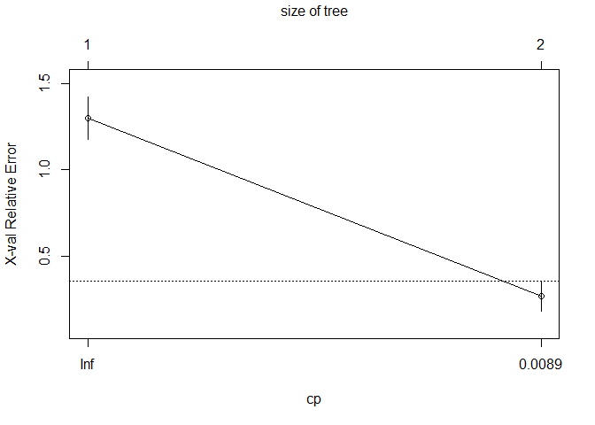<!-- -->

    ## 
    ## Optimal Complexity Parameter (CP): 1e-04

    ## Final Tree Size: 3 nodes

    ## 
    ## === Confusion Matrix ===

    ##          Actual
    ## Predicted Class0 Class1
    ##    Class0      9      2
    ##    Class1      1      4

    ## 
    ## Accuracy: 0.8125

    ## 
    ## Sensitivity (Recall): 0.6667

    ## 
    ## Specificity: 0.9

    ## 
    ## Test AUC: 0.7833

    ## 
    ## === Variable Importance ===

    ##        V2        V3        V1      V109       V38       V17 
    ## 19.767665 15.677804  8.861367  8.861367  7.498080  6.816436

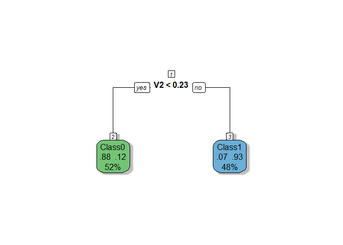<!-- --> The RPART
model demonstrates moderate performance with a cross-validation AUC of
0.81 and a test AUC of 0.78, indicating no significant overfitting and
better consistency compared to Ridge. The tree is based solely on one
variable (V2), making the model extremely simple and transparent, but
potentially underutilizing valuable information from other features.
Let’s fine-tune hyperparameters to improve robustness of the tree.

## 3.2 Fine-tuned RPART

    ## 
    ## === Cross-Validation Results ===

    ## Mean Cross-Validation AUC: 0.8441

    ## 
    ## === RPART Model Summary ===

    ## 
    ## Classification tree:
    ## rpart(formula = Y_train ~ ., data = data.frame(X_train_scaled, 
    ##     Y_train = Y_train), method = "class", control = rpart.control(xval = 5, 
    ##     cp = 1e-04, minsplit = 5, minbucket = 5, maxdepth = 5))
    ## 
    ## Variables actually used in tree construction:
    ## [1] V2 V6
    ## 
    ## Root node error: 30/61 = 0.4918
    ## 
    ## n= 61 
    ## 
    ##      CP nsplit rel error  xerror     xstd
    ## 1 8e-01      0       1.0 1.30000 0.125014
    ## 2 1e-01      1       0.2 0.26667 0.087881
    ## 3 1e-04      2       0.1 0.20000 0.077530

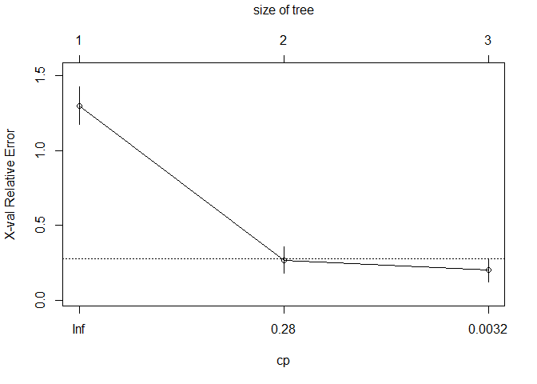<!-- -->

    ## 
    ## Optimal Complexity Parameter (CP): 1e-04

    ## Final Tree Size: 5 nodes

    ## 
    ## === Confusion Matrix ===

    ##          Actual
    ## Predicted Class0 Class1
    ##    Class0      8      0
    ##    Class1      2      6

    ## 
    ## Accuracy: 0.875

    ## 
    ## Sensitivity (Recall): 1

    ## 
    ## Specificity: 0.8

    ## 
    ## Test AUC: 0.9167

    ## 
    ## === Variable Importance ===

    ##        V2        V3      V109        V1       V38       V17        V6       V23 
    ## 19.767665 15.677804 12.101367  8.861367  7.498080  6.816436  5.400000  3.240000 
    ##        V4       V43        V5 
    ##  2.160000  2.160000  2.160000

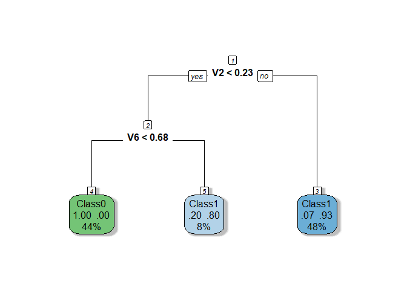<!-- --> The tuned
RPART model demonstrates improved performance, with a cross-validation
AUC of 0.8441 and a test AUC of 0.9167, achieving better generalization
and consistency compared to the initial version. Reducing `minbucket` to
5 was the only hyperparameter change that yielded positive results, as
adjustments to other parameters like `cp`, `minsplit`, and `maxdepth`
did not lead to further improvements. The resulting tree now uses two
variables (V2 and V6) and grows to 5 nodes, balancing simplicity with
the ability to capture more information from the data.

# 4. Random forest

## 4.1 Basic Random forest

    ## 
    ## === Cross-Validation Results ===

    ## Mean AUC: 1

    ## Mean Accuracy: 0.9179

    ## Mean Sensitivity (Recall): 0.9167

    ## Mean Specificity: 0.9417

    ## 
    ## === Confusion Matrix ===

    ##          Actual
    ## Predicted Class0 Class1
    ##    Class0      9      2
    ##    Class1      1      4

    ## 
    ## Accuracy: 0.8125

    ## 
    ## Sensitivity (Recall): 0.6667

    ## 
    ## Specificity: 0.9

    ## 
    ## Test AUC: 0.9333

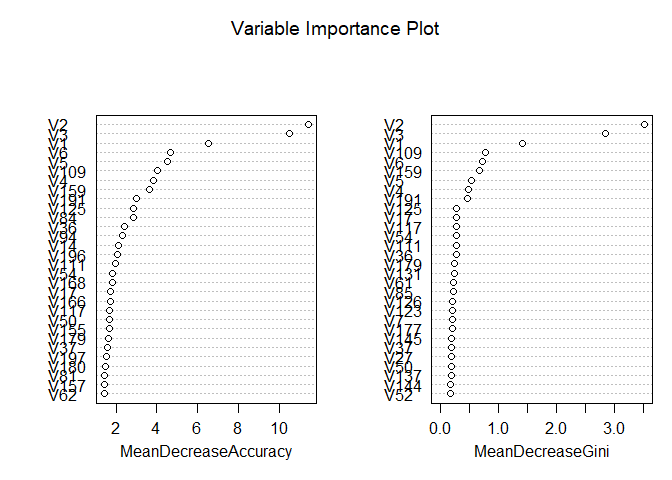<!-- --> Despite the
Random Forest model achieving a slightly higher test AUC (0.93) compared
to the fine-tuned RPART model (0.92), its perfect cross-validation AUC
of 1 strongly suggests overfitting, particularly given the small dataset
size. The RPART model, by contrast, is based on just two variables (V2
and V6) and has a simple 5-node structure, offering transparency and
interpretability, whereas Random Forest’s ensemble nature makes it more
complex and less interpretable, which can be a disadvantage in contexts
requiring explainability. In this case, the fine-tuned RPART model
appears more reliable than Random Forest. Nonetheless, let’s explore
VSURF feature selection technique, to potentially improve Random
Forest’s performance and reduce overfitting risks.

## 4.2 Random forest with VSURF

    ## 
    ## === Cross-Validation Results ===

    ## Mean AUC: 1

    ## Mean Accuracy: 0.9179

    ## Mean Sensitivity (Recall): 0.9167

    ## Mean Specificity: 0.9417

    ## Thresholding step
    ## Estimated computational time (on one core): 2 sec.
    ## 
    ## Interpretation step (on 20 variables)
    ## Estimated computational time (on one core): between 0 sec. and  4 sec.
    ## 
    ## Prediction step (on 3 variables)
    ## Maximum estimated computational time (on one core): 0 sec.
    ##   |                                                                              |                                                                      |   0%  |                                                                              |=======================                                               |  33%  |                                                                              |===============================================                       |  67%  |                                                                              |======================================================================| 100%

    ## 
    ## === Confusion Matrix ===

    ##          Actual
    ## Predicted Class0 Class1
    ##    Class0      8      1
    ##    Class1      2      5

    ## 
    ## Accuracy: 0.8125

    ## 
    ## Sensitivity (Recall): 0.8333

    ## 
    ## Specificity: 0.8

    ## 
    ## Test AUC: 0.95

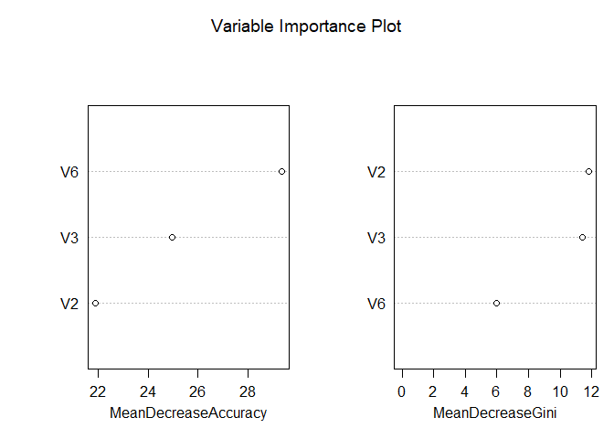<!-- -->

The Random Forest model with feature selection using **VSURF** shows
strong performance, achieving a test AUC of 0.95, which is slightly
higher than the previous Random Forest model (AUC = 0.9333). However,
the cross-validation metrics remain suspiciously perfect (AUC = 1,
accuracy = 0.9179), suggesting that overfitting is still a concern,
likely due to the small dataset size and limited test set. The VSURF
process reduced the number of variables to 3 for the final prediction
step, improving interpretability compared to the original Random Forest
model while maintaining competitive performance. While the model
demonstrates better generalization than before, its inflated
cross-validation results indicate that further validation is necessary
to confirm its reliability.

# 5. Conclusion

We have chosen three candidate models: RIDGE, Fine-tuned RPART, and
Random Forest with VSURF to identify the best-performing model for the
dataset. The fine-tuned RPART model stands out as the most reliable
choice despite its slightly lower test AUC (0.9167), as it avoids the
overfitting risks seen in Ridge’s reliance on all features and Random
Forest’s perfect cross-validation metrics. Its simplicity,
interpretability, and focus on just two key variables (V2 and V6) make
it more practical for real-world applications. Notably, all three models
consistently identify V2, V3, and V6 as the most important features,
highlighting their critical role in capturing underlying patterns. This
agreement across different modeling approaches reinforces the relevance
of these variables and suggests they should be prioritized in future
analyses or model development.

# Task 2.2: PM10 Modeling with VSURF Rouen Data

**Task statement.** Repeat the modeling workflow using real-world PM10
pollution observations from the Rouen area available in the `VSURF`
package, and identify the best-performing approach.

# 1. Data Analysis and Preprocessing

## 1.0 Load necessary libraries

## 1.1 Open Dataset

    ## 'data.frame':    1096 obs. of  18 variables:
    ##  $ PM10     : int  12 15 25 33 23 14 20 15 22 28 ...
    ##  $ NO       : int  14 7 22 34 41 14 19 13 9 13 ...
    ##  $ NO2      : int  37 28 47 43 46 48 51 42 45 48 ...
    ##  $ SO2      : int  8 7 13 16 19 18 11 12 8 12 ...
    ##  $ T.min    : num  -0.6 -1.3 -4.2 -2.5 2.4 6.5 3 4.8 5.6 5.4 ...
    ##  $ T.max    : num  4.4 5.6 -0.7 4 7.7 9.1 8.8 9 10.4 11.7 ...
    ##  $ T.moy    : num  1.17 2.01 -2.93 1.52 5.03 ...
    ##  $ DV.maxvv : int  160 20 40 200 200 210 160 160 260 210 ...
    ##  $ DV.dom   : num  180 22.5 180 202.5 180 ...
    ##  $ VV.max   : int  8 7 3 4 5 6 7 9 10 7 ...
    ##  $ VV.moy   : num  5.35 4.96 2.25 2.71 3.25 ...
    ##  $ PL.som   : int  11 3 0 0 0 0 0 9 3 0 ...
    ##  $ HR.min   : int  93 78 63 86 91 87 74 85 74 82 ...
    ##  $ HR.max   : int  97 96 91 97 98 97 94 96 94 97 ...
    ##  $ HR.moy   : num  96.2 87.9 82.6 94 96.2 ...
    ##  $ PA.moy   : num  1011 1017 1024 1022 1022 ...
    ##  $ GTrouen  : num  0.7 -0.5 2.4 2.7 2.4 0.6 -0.1 0 -0.1 1.2 ...
    ##  $ GTlehavre: num  -0.3 0 0.1 -0.2 -0.2 -0.3 -0.5 NA -0.5 0.1 ...

## 1.2 Dataset summary

    ## Dataset structure:

    ## List of 2
    ##  $ X:'data.frame':   1096 obs. of  17 variables:
    ##   ..$ NO       : int [1:1096] 14 7 22 34 41 14 19 13 9 13 ...
    ##   ..$ NO2      : int [1:1096] 37 28 47 43 46 48 51 42 45 48 ...
    ##   ..$ SO2      : int [1:1096] 8 7 13 16 19 18 11 12 8 12 ...
    ##   ..$ T.min    : num [1:1096] -0.6 -1.3 -4.2 -2.5 2.4 6.5 3 4.8 5.6 5.4 ...
    ##   ..$ T.max    : num [1:1096] 4.4 5.6 -0.7 4 7.7 9.1 8.8 9 10.4 11.7 ...
    ##   ..$ T.moy    : num [1:1096] 1.17 2.01 -2.93 1.52 5.03 ...
    ##   ..$ DV.maxvv : int [1:1096] 160 20 40 200 200 210 160 160 260 210 ...
    ##   ..$ DV.dom   : num [1:1096] 180 22.5 180 202.5 180 ...
    ##   ..$ VV.max   : int [1:1096] 8 7 3 4 5 6 7 9 10 7 ...
    ##   ..$ VV.moy   : num [1:1096] 5.35 4.96 2.25 2.71 3.25 ...
    ##   ..$ PL.som   : int [1:1096] 11 3 0 0 0 0 0 9 3 0 ...
    ##   ..$ HR.min   : int [1:1096] 93 78 63 86 91 87 74 85 74 82 ...
    ##   ..$ HR.max   : int [1:1096] 97 96 91 97 98 97 94 96 94 97 ...
    ##   ..$ HR.moy   : num [1:1096] 96.2 87.9 82.6 94 96.2 ...
    ##   ..$ PA.moy   : num [1:1096] 1011 1017 1024 1022 1022 ...
    ##   ..$ GTrouen  : num [1:1096] 0.7 -0.5 2.4 2.7 2.4 0.6 -0.1 0 -0.1 1.2 ...
    ##   ..$ GTlehavre: num [1:1096] -0.3 0 0.1 -0.2 -0.2 -0.3 -0.5 NA -0.5 0.1 ...
    ##  $ Y: int [1:1096] 12 15 25 33 23 14 20 15 22 28 ...

    ## 
    ## Feature matrix dimensions: 1096 17

    ## 
    ## Response variable summary (numeric):

    ##    Min. 1st Qu.  Median    Mean 3rd Qu.    Max.    NA's 
    ##    6.00   16.00   20.00   21.19   25.00   95.00      10

The dataset differs from the original as the response variable is
numeric, not binary. Also now we have a much better dataset with just 17
variables and 1096 observations

## 1.3 Check for missing values

    ## 
    ## 
    ## Missing values check:

    ## 
    ## Features missing values: 89

    ## 
    ## Response missing values: 10

As the number of the missing values is insignificant, for the sake of
simplicity we just delete them

    ## Removed rows: 64

    ## New dataset size: 1032 observations

Let’s double check the missing values after we have deleted the rows
with missing values

    ## 
    ## 
    ## Missing values check:

    ## 
    ## Features missing values: 0

    ## 
    ## Response missing values: 0

## 1.5 Check scaling need

    ## 
    ## 
    ## Scaling check:

    ## 
    ## Feature mean range: 0.62 1017.62

    ## 
    ## Feature SD range: 1.24 102.77

Obviously scaling is required. We will apply it on the subsequent steps.

## 1.6 Check for multicollinearity

    ## 
    ## 
    ## Highly correlated feature pairs (|r| > 0.8): 5

    ## 
    ## Highly Correlated Feature Pair 1 :
    ## Feature 1: T.min 
    ## Feature 2: T.max 
    ## Correlation between T.min and T.max : 0.9 
    ## 
    ## Highly Correlated Feature Pair 2 :
    ## Feature 1: T.min 
    ## Feature 2: T.moy 
    ## Correlation between T.min and T.moy : 0.96 
    ## 
    ## Highly Correlated Feature Pair 3 :
    ## Feature 1: T.max 
    ## Feature 2: T.moy 
    ## Correlation between T.max and T.moy : 0.98 
    ## 
    ## Highly Correlated Feature Pair 4 :
    ## Feature 1: VV.max 
    ## Feature 2: VV.moy 
    ## Correlation between VV.max and VV.moy : 0.91 
    ## 
    ## Highly Correlated Feature Pair 5 :
    ## Feature 1: HR.min 
    ## Feature 2: HR.moy 
    ## Correlation between HR.min and HR.moy : 0.92

The analysis identified five highly correlated feature pairs within the
temperature, wind, and humidity categories, each exhibiting correlation
coefficients above 0.8. Specifically, the temperature features (T.min,
T.max, T.moy), wind features (VV.max, VV.moy), and humidity features
(HR.min, HR.moy) show strong interrelationships. Given this high
multicollinearity, it may be tempting to retain only the average values
for each category. However, the analysis will initially include all
features and progressively address multicollinearity by eliminating
redundant variables.

## 1.7 Summary of the data analysis

### Summary of the New Dataset and Analysis Plan

1.  **Moderate-Dimensional Data with Sufficient Observations**:
    - The feature matrix has dimensions of **1032 observations x 17
      features**, making this dataset significantly different from the
      previous one. Unlike the earlier dataset, where the number of
      features far exceeded the number of observations (p \> n), this
      dataset is well-suited for traditional statistical methods such as
      **Ordinary Least Squares (OLS) regression**. The ratio of
      observations to features (n=1032, p=17) ensures that the design
      matrix \$ X’X \$ is invertible, enabling reliable estimation of
      model coefficients.
    - Among the 17 features, **5 are multicollinear**, which introduces
      redundancy in the dataset. This multicollinearity is likely due to
      overlapping information across certain features, as some features
      represent ranges or categories that could be summarized by
      averages. While it may be tempting to simplify the dataset by
      retaining only average values for each category, the analysis will
      initially include all features and progressively address
      multicollinearity through systematic elimination of redundant
      variables.
2.  **Numeric Response Variable**:
    - Unlike the binary response variable in the previous dataset, the
      response variable in this dataset is **numeric**. This indicates a
      regression problem rather than a classification task.
3.  **Scaling and Feature Standardization**:
    - Standardization will still be applied to ensure comparability and
      improve the performance of models sensitive to feature scaling,
      such as PCA and regularized regression. Scaling will also help
      mitigate potential issues arising from multicollinearity during
      model training.
4.  **Modeling Approach**:
    - Given the improved characteristics of this dataset (sufficient
      observations and moderate dimensionality), we can now employ a
      broader range of modeling techniques. The analysis will proceed as
      follows:
      - **4.1 Start with OLS**: As the dataset satisfies the conditions
        for OLS (n \> p and no singularities in \$ X’X \$), we will
        begin with a baseline linear regression model to establish a
        performance benchmark.
      - **4.2 Correlation Filtering**: To address multicollinearity, we
        will identify and remove highly correlated features based on
        pairwise correlation coefficients. This step will reduce
        redundancy while preserving interpretability.
      - **4.3 Apply Variance Inflation Factor (VIF)**: VIF will be used
        to assess and mitigate multicollinearity. Features with high VIF
        values (e.g., \>10) will be removed iteratively until
        multicollinearity is sufficiently reduced.
      - **4.4 Stepwise Selection**: A stepwise feature selection
        approach (forward, backward, or hybrid) will be applied to
        identify the most relevant subset of features for predicting the
        response variable.
      - **4.5 Principal Component Analysis (PCA)**: PCA will be explored
        as a dimensionality reduction technique to capture the majority
        of variance in the data using fewer components. This will help
        address any residual multicollinearity and reduce noise in the
        dataset.
    - Following these preprocessing steps, we will proceed with the same
      suite of models used in the previous analysis:
      - **Regularized Models**: Lasso, Ridge, and Elastic Net will be
        evaluated for their ability to handle multicollinearity and
        perform implicit feature selection.
      - **Tree-Based Models**: CART and Random Forest will serve as
        robust alternatives, particularly for capturing nonlinear
        relationships and interactions among features. VSURF will again
        be used for feature selection within the Random Forest
        framework.
5.  **Cross-Validation and Train-Test Split**:
    - Despite the larger dataset, **cross-validation** remains essential
      to ensure robust model evaluation and generalization. We will use
      **5-fold cross-validation** to maximize the use of the available
      data while minimizing variance in performance estimates.
    - The dataset will be split into **80% training** and **20%
      testing** subsets. Model performance will be evaluated on the test
      set using metrics appropriate for regression tasks, such as **Mean
      Squared Error (MSE)**, **Root Mean Squared Error (RMSE)**, and
      **R-squared (\$ R^2 \$)**. These metrics provide insights into
      prediction accuracy and the proportion of variance explained by
      the model.

# 2. Basic regression models

## 2.1 Basic LM

    ## 
    ## === Linear Model Summary ===

    ## 
    ## Call:
    ## lm(formula = Y ~ ., data = train_df)
    ## 
    ## Residuals:
    ##     Min      1Q  Median      3Q     Max 
    ## -13.143  -3.413  -0.595   2.582  49.569 
    ## 
    ## Coefficients:
    ##             Estimate Std. Error t value Pr(>|t|)    
    ## (Intercept) 21.26182    0.19864 107.040  < 2e-16 ***
    ## NO           3.66921    0.32151  11.413  < 2e-16 ***
    ## NO2          1.36561    0.32519   4.199 2.97e-05 ***
    ## SO2          1.65814    0.25542   6.492 1.48e-10 ***
    ## T.min        3.62535    1.20365   3.012  0.00268 ** 
    ## T.max        5.99994    1.95246   3.073  0.00219 ** 
    ## T.moy       -7.21958    2.60193  -2.775  0.00565 ** 
    ## DV.maxvv    -0.40568    0.26198  -1.549  0.12189    
    ## DV.dom      -0.53909    0.26921  -2.002  0.04557 *  
    ## VV.max      -0.40471    0.51630  -0.784  0.43335    
    ## VV.moy      -0.08347    0.53393  -0.156  0.87582    
    ## PL.som      -0.57053    0.22945  -2.486  0.01310 *  
    ## HR.min       1.43588    0.74140   1.937  0.05313 .  
    ## HR.max      -0.60187    0.39285  -1.532  0.12590    
    ## HR.moy      -1.57377    0.89052  -1.767  0.07756 .  
    ## PA.moy       0.74323    0.24298   3.059  0.00230 ** 
    ## GTrouen      0.18567    0.37425   0.496  0.61996    
    ## GTlehavre    1.06773    0.34076   3.133  0.00179 ** 
    ## ---
    ## Signif. codes:  0 '***' 0.001 '**' 0.01 '*' 0.05 '.' 0.1 ' ' 1
    ## 
    ## Residual standard error: 5.705 on 807 degrees of freedom
    ## Multiple R-squared:  0.5717, Adjusted R-squared:  0.5627 
    ## F-statistic: 63.37 on 17 and 807 DF,  p-value: < 2.2e-16

    ## 
    ## === Cross-Validation Results ===

    ##   Fold      MSE     RMSE        R2
    ## 1    1 61.79753 7.861140 0.4658901
    ## 2    2 37.00695 6.083334 0.6008507
    ## 3    3 24.98802 4.998802 0.5955907
    ## 4    4 24.20858 4.920221 0.5635860
    ## 5    5 24.57733 4.957553 0.4486567

    ## 
    ## Mean CV MSE: 34.5157

    ## 
    ## Mean CV RMSE: 5.7642

    ## 
    ## Mean CV R-squared: 0.5349

    ## 
    ## === Test Set Evaluation ===

    ## MSE: 27.9471

    ## RMSE: 5.2865

    ## R-squared: 0.4961

    ## 
    ## === Model Coefficients ===

    ##        Feature Coefficient
    ## 1  (Intercept)     21.2618
    ## 2           NO      3.6692
    ## 3          NO2      1.3656
    ## 4          SO2      1.6581
    ## 5        T.min      3.6253
    ## 6        T.max      5.9999
    ## 7        T.moy     -7.2196
    ## 8     DV.maxvv     -0.4057
    ## 9       DV.dom     -0.5391
    ## 10      VV.max     -0.4047
    ## 11      VV.moy     -0.0835
    ## 12      PL.som     -0.5705
    ## 13      HR.min      1.4359
    ## 14      HR.max     -0.6019
    ## 15      HR.moy     -1.5738
    ## 16      PA.moy      0.7432
    ## 17     GTrouen      0.1857
    ## 18   GTlehavre      1.0677

    ## 
    ## Number of coefficients (including intercept): 18

    ## 
    ## Number of features (excluding intercept): 17

## 2.2 Correlation Filtering

    ## 
    ## === Correlation Filtering ===

    ## Highly correlated feature pairs (|r| > 0.8): 5

    ## 
    ## Removing features with high multicollinearity:
    ## [1] "T.max"  "T.moy"  "VV.moy" "HR.moy"
    ## 
    ## Highly correlated pairs details:
    ## T.min           vs T.max          : r = 0.90
    ## T.min           vs T.moy          : r = 0.96
    ## T.max           vs T.moy          : r = 0.98
    ## VV.max          vs VV.moy         : r = 0.91
    ## HR.min          vs HR.moy         : r = 0.92

    ## 
    ## === Linear Model Summary ===

    ## 
    ## Call:
    ## lm(formula = Y ~ ., data = train_df)
    ## 
    ## Residuals:
    ##     Min      1Q  Median      3Q     Max 
    ## -13.821  -3.473  -0.610   2.440  50.311 
    ## 
    ## Coefficients:
    ##             Estimate Std. Error t value Pr(>|t|)    
    ## (Intercept)  21.2618     0.1994 106.609  < 2e-16 ***
    ## NO            3.7271     0.3219  11.579  < 2e-16 ***
    ## NO2           1.4170     0.3204   4.422 1.11e-05 ***
    ## SO2           1.7053     0.2549   6.689 4.17e-11 ***
    ## T.min         2.0569     0.2695   7.633 6.43e-14 ***
    ## DV.maxvv     -0.4152     0.2597  -1.599  0.11018    
    ## DV.dom       -0.6364     0.2678  -2.376  0.01774 *  
    ## VV.max       -0.4760     0.2525  -1.885  0.05982 .  
    ## PL.som       -0.5597     0.2264  -2.473  0.01361 *  
    ## HR.min       -0.2854     0.2854  -1.000  0.31757    
    ## HR.max       -0.9466     0.2516  -3.763  0.00018 ***
    ## PA.moy        0.7353     0.2411   3.049  0.00237 ** 
    ## GTrouen       0.4042     0.3438   1.176  0.24006    
    ## GTlehavre     1.1842     0.3383   3.500  0.00049 ***
    ## ---
    ## Signif. codes:  0 '***' 0.001 '**' 0.01 '*' 0.05 '.' 0.1 ' ' 1
    ## 
    ## Residual standard error: 5.728 on 811 degrees of freedom
    ## Multiple R-squared:  0.5661, Adjusted R-squared:  0.5592 
    ## F-statistic:  81.4 on 13 and 811 DF,  p-value: < 2.2e-16

    ## 
    ## === Cross-Validation Results ===

    ##   Fold      MSE     RMSE        R2
    ## 1    1 61.43289 7.837914 0.4690416
    ## 2    2 36.84339 6.069876 0.6026148
    ## 3    3 25.43862 5.043671 0.5882982
    ## 4    4 23.61515 4.859543 0.5742838
    ## 5    5 25.20303 5.020262 0.4346206

    ## 
    ## Mean CV MSE: 34.5066

    ## 
    ## Mean CV RMSE: 5.7663

    ## 
    ## Mean CV R-squared: 0.5338

    ## 
    ## === Test Set Evaluation ===

    ## MSE: 28.4852

    ## RMSE: 5.3372

    ## R-squared: 0.4864

    ## 
    ## === Model Coefficients ===

    ##        Feature Coefficient
    ## 1  (Intercept)     21.2618
    ## 2           NO      3.7271
    ## 3          NO2      1.4170
    ## 4          SO2      1.7053
    ## 5        T.min      2.0569
    ## 6     DV.maxvv     -0.4152
    ## 7       DV.dom     -0.6364
    ## 8       VV.max     -0.4760
    ## 9       PL.som     -0.5597
    ## 10      HR.min     -0.2854
    ## 11      HR.max     -0.9466
    ## 12      PA.moy      0.7353
    ## 13     GTrouen      0.4042
    ## 14   GTlehavre      1.1842

    ## 
    ## Number of coefficients (including intercept): 14

    ## 
    ## Number of features (excluding intercept): 13

## 2.3 Variance Inflation Factor (VIF)

    ## 
    ## === VIF Analysis ===

    ## Loading required package: carData

    ## 
    ## -- VIF Iteration 1 --
    ## Removing feature: T.moy (VIF = 171.4 )
    ## 
    ## -- VIF Iteration 2 --
    ## Removing feature: T.max (VIF = 21.2 )
    ## 
    ## -- VIF Iteration 3 --
    ## Removing feature: HR.moy (VIF = 16.7 )
    ## 
    ## -- VIF Iteration 4 --

    ## 
    ## Final removed features by VIF: T.moy, T.max, HR.moy

    ## 
    ## === Linear Model Summary ===

    ## 
    ## Call:
    ## lm(formula = Y ~ ., data = train_df)
    ## 
    ## Residuals:
    ##     Min      1Q  Median      3Q     Max 
    ## -13.833  -3.482  -0.597   2.433  50.341 
    ## 
    ## Coefficients:
    ##             Estimate Std. Error t value Pr(>|t|)    
    ## (Intercept)  21.2618     0.1996 106.548  < 2e-16 ***
    ## NO            3.7267     0.3221  11.571  < 2e-16 ***
    ## NO2           1.4053     0.3236   4.343 1.58e-05 ***
    ## SO2           1.7066     0.2551   6.690 4.17e-11 ***
    ## T.min         2.0558     0.2697   7.624 6.90e-14 ***
    ## DV.maxvv     -0.4263     0.2631  -1.620 0.105537    
    ## DV.dom       -0.6311     0.2687  -2.349 0.019084 *  
    ## VV.max       -0.3557     0.5157  -0.690 0.490525    
    ## VV.moy       -0.1417     0.5297  -0.267 0.789201    
    ## PL.som       -0.5699     0.2297  -2.481 0.013285 *  
    ## HR.min       -0.2687     0.2923  -0.919 0.358261    
    ## HR.max       -0.9622     0.2584  -3.724 0.000210 ***
    ## PA.moy        0.7313     0.2417   3.025 0.002562 ** 
    ## GTrouen       0.3960     0.3453   1.147 0.251790    
    ## GTlehavre     1.1815     0.3387   3.489 0.000511 ***
    ## ---
    ## Signif. codes:  0 '***' 0.001 '**' 0.01 '*' 0.05 '.' 0.1 ' ' 1
    ## 
    ## Residual standard error: 5.732 on 810 degrees of freedom
    ## Multiple R-squared:  0.5662, Adjusted R-squared:  0.5587 
    ## F-statistic:  75.5 on 14 and 810 DF,  p-value: < 2.2e-16

    ## 
    ## === Cross-Validation Results ===

    ##   Fold      MSE     RMSE        R2
    ## 1    1 61.81030 7.861953 0.4657797
    ## 2    2 36.84752 6.070215 0.6025704
    ## 3    3 25.48758 5.048523 0.5875057
    ## 4    4 23.63101 4.861173 0.5739980
    ## 5    5 25.20225 5.020184 0.4346380

    ## 
    ## Mean CV MSE: 34.5957

    ## 
    ## Mean CV RMSE: 5.7724

    ## 
    ## Mean CV R-squared: 0.5329

    ## 
    ## === Test Set Evaluation ===

    ## MSE: 28.457

    ## RMSE: 5.3345

    ## R-squared: 0.4869

    ## 
    ## === Final Model Diagnostics ===

    ## 
    ## Variance Inflation Factors (VIF):
    ##      Feature      VIF
    ## 1         NO 2.601794
    ## 2        NO2 2.626030
    ## 3        SO2 1.632406
    ## 4      T.min 1.823807
    ## 5   DV.maxvv 1.735874
    ## 6     DV.dom 1.811104
    ## 7     VV.max 6.671103
    ## 8     VV.moy 7.037325
    ## 9     PL.som 1.323062
    ## 10    HR.min 2.143153
    ## 11    HR.max 1.674314
    ## 12    PA.moy 1.465635
    ## 13   GTrouen 2.991305
    ## 14 GTlehavre 2.876678

    ## 
    ## === Model Coefficients ===

    ##        Feature Coefficient
    ## 1  (Intercept)     21.2618
    ## 2           NO      3.7267
    ## 3          NO2      1.4053
    ## 4          SO2      1.7066
    ## 5        T.min      2.0558
    ## 6     DV.maxvv     -0.4263
    ## 7       DV.dom     -0.6311
    ## 8       VV.max     -0.3557
    ## 9       VV.moy     -0.1417
    ## 10      PL.som     -0.5699
    ## 11      HR.min     -0.2687
    ## 12      HR.max     -0.9622
    ## 13      PA.moy      0.7313
    ## 14     GTrouen      0.3960
    ## 15   GTlehavre      1.1815

    ## 
    ## Number of coefficients (including intercept): 15

    ## 
    ## Number of features (excluding intercept): 14

## 2.4 Stepwise Selection

    ## 
    ## === Stepwise Selection ===

    ## Start:  AIC=2891.12
    ## Y ~ NO + NO2 + SO2 + T.min + T.max + T.moy + DV.maxvv + DV.dom + 
    ##     VV.max + VV.moy + PL.som + HR.min + HR.max + HR.moy + PA.moy + 
    ##     GTrouen + GTlehavre
    ## 
    ##             Df Sum of Sq   RSS    AIC
    ## - VV.moy     1       0.8 26270 2889.2
    ## - GTrouen    1       8.0 26277 2889.4
    ## - VV.max     1      20.0 26289 2889.8
    ## <none>                   26269 2891.1
    ## - HR.max     1      76.4 26345 2891.5
    ## - DV.maxvv   1      78.1 26347 2891.6
    ## - HR.moy     1     101.7 26370 2892.3
    ## - HR.min     1     122.1 26391 2892.9
    ## - DV.dom     1     130.5 26399 2893.2
    ## - PL.som     1     201.3 26470 2895.4
    ## - T.moy      1     250.6 26519 2896.9
    ## - T.min      1     295.3 26564 2898.3
    ## - PA.moy     1     304.5 26573 2898.6
    ## - T.max      1     307.4 26576 2898.7
    ## - GTlehavre  1     319.6 26588 2899.1
    ## - NO2        1     574.1 26843 2907.0
    ## - SO2        1    1371.8 27641 2931.1
    ## - NO         1    4239.7 30508 3012.6
    ## 
    ## Step:  AIC=2889.15
    ## Y ~ NO + NO2 + SO2 + T.min + T.max + T.moy + DV.maxvv + DV.dom + 
    ##     VV.max + PL.som + HR.min + HR.max + HR.moy + PA.moy + GTrouen + 
    ##     GTlehavre
    ## 
    ##             Df Sum of Sq   RSS    AIC
    ## - GTrouen    1       8.4 26278 2887.4
    ## <none>                   26270 2889.2
    ## - HR.max     1      75.8 26345 2889.5
    ## - DV.maxvv   1      77.5 26347 2889.6
    ## - HR.moy     1     100.9 26371 2890.3
    ## - VV.max     1     115.5 26385 2890.8
    ## - HR.min     1     121.9 26391 2891.0
    ## + VV.moy     1       0.8 26269 2891.1
    ## - DV.dom     1     132.7 26402 2891.3
    ## - PL.som     1     202.0 26472 2893.5
    ## - T.moy      1     253.4 26523 2895.1
    ## - T.min      1     296.0 26566 2896.4
    ## - PA.moy     1     309.2 26579 2896.8
    ## - T.max      1     311.9 26582 2896.9
    ## - GTlehavre  1     320.9 26591 2897.2
    ## - NO2        1     586.4 26856 2905.4
    ## - SO2        1    1371.2 27641 2929.1
    ## - NO         1    4239.3 30509 3010.6
    ## 
    ## Step:  AIC=2887.41
    ## Y ~ NO + NO2 + SO2 + T.min + T.max + T.moy + DV.maxvv + DV.dom + 
    ##     VV.max + PL.som + HR.min + HR.max + HR.moy + PA.moy + GTlehavre
    ## 
    ##             Df Sum of Sq   RSS    AIC
    ## <none>                   26278 2887.4
    ## - DV.maxvv   1      73.8 26352 2887.7
    ## - HR.max     1      75.4 26353 2887.8
    ## - HR.moy     1      99.6 26378 2888.5
    ## + GTrouen    1       8.4 26270 2889.2
    ## - HR.min     1     123.4 26401 2889.3
    ## - VV.max     1     124.4 26402 2889.3
    ## + VV.moy     1       1.2 26277 2889.4
    ## - DV.dom     1     131.9 26410 2889.5
    ## - PL.som     1     208.7 26487 2891.9
    ## - T.moy      1     253.4 26531 2893.3
    ## - T.min      1     288.6 26567 2894.4
    ## - PA.moy     1     305.7 26584 2894.9
    ## - T.max      1     343.4 26621 2896.1
    ## - GTlehavre  1     511.4 26789 2901.3
    ## - NO2        1     613.8 26892 2904.5
    ## - SO2        1    1369.0 27647 2927.3
    ## - NO         1    4422.5 30701 3013.7

    ## Selected features after stepwise selection: NO, NO2, SO2, T.min, T.max, T.moy, DV.maxvv, DV.dom, VV.max, PL.som, HR.min, HR.max, HR.moy, PA.moy, GTlehavre

    ## 
    ## === Linear Model Summary ===

    ## 
    ## Call:
    ## lm(formula = selected_formula, data = train_df)
    ## 
    ## Residuals:
    ##     Min      1Q  Median      3Q     Max 
    ## -13.210  -3.440  -0.644   2.546  49.610 
    ## 
    ## Coefficients:
    ##             Estimate Std. Error t value Pr(>|t|)    
    ## (Intercept)  21.2618     0.1984 107.153  < 2e-16 ***
    ## NO            3.6960     0.3168  11.668  < 2e-16 ***
    ## NO2           1.3919     0.3202   4.347 1.56e-05 ***
    ## SO2           1.6554     0.2550   6.492 1.48e-10 ***
    ## T.min         3.4918     1.1714   2.981  0.00296 ** 
    ## T.max         6.2092     1.9098   3.251  0.00120 ** 
    ## T.moy        -7.2458     2.5941  -2.793  0.00534 ** 
    ## DV.maxvv     -0.3885     0.2577  -1.507  0.13208    
    ## DV.dom       -0.5405     0.2682  -2.015  0.04421 *  
    ## VV.max       -0.4899     0.2503  -1.957  0.05067 .  
    ## PL.som       -0.5730     0.2261  -2.535  0.01144 *  
    ## HR.min        1.4274     0.7323   1.949  0.05160 .  
    ## HR.max       -0.5971     0.3919  -1.524  0.12799    
    ## HR.moy       -1.5483     0.8842  -1.751  0.08031 .  
    ## PA.moy        0.7415     0.2417   3.068  0.00223 ** 
    ## GTlehavre     1.1582     0.2919   3.968 7.89e-05 ***
    ## ---
    ## Signif. codes:  0 '***' 0.001 '**' 0.01 '*' 0.05 '.' 0.1 ' ' 1
    ## 
    ## Residual standard error: 5.699 on 809 degrees of freedom
    ## Multiple R-squared:  0.5716, Adjusted R-squared:  0.5636 
    ## F-statistic: 71.95 on 15 and 809 DF,  p-value: < 2.2e-16

    ## 
    ## === Cross-Validation Results ===

    ##   Fold      MSE     RMSE        R2
    ## 1    1 61.00122 7.810328 0.4727725
    ## 2    2 36.96371 6.079778 0.6013172
    ## 3    3 24.94626 4.994623 0.5962666
    ## 4    4 24.14199 4.913450 0.5647864
    ## 5    5 24.33609 4.933162 0.4540686

    ## 
    ## Mean CV MSE: 34.2779

    ## 
    ## Mean CV RMSE: 5.7463

    ## 
    ## Mean CV R-squared: 0.5378

    ## 
    ## === Test Set Evaluation ===

    ## MSE: 27.8327

    ## RMSE: 5.2757

    ## R-squared: 0.4981

    ## 
    ## === Final Model Coefficients ===

    ##        Feature Coefficient
    ## 1  (Intercept)     21.2618
    ## 2           NO      3.6960
    ## 3          NO2      1.3919
    ## 4          SO2      1.6554
    ## 5        T.min      3.4918
    ## 6        T.max      6.2092
    ## 7        T.moy     -7.2458
    ## 8     DV.maxvv     -0.3885
    ## 9       DV.dom     -0.5405
    ## 10      VV.max     -0.4899
    ## 11      PL.som     -0.5730
    ## 12      HR.min      1.4274
    ## 13      HR.max     -0.5971
    ## 14      HR.moy     -1.5483
    ## 15      PA.moy      0.7415
    ## 16   GTlehavre      1.1582

    ## 
    ## Number of coefficients (including intercept): 16

    ## 
    ## Number of features (excluding intercept): 15

## 2.5 Principal Component Analysis (PCA)

    ## 
    ## === PCA-Based Dimension Reduction ===

    ## Number of principal components selected: 9

    ## 
    ## === Linear Model Summary ===

    ## 
    ## Call:
    ## lm(formula = Y ~ ., data = train_pcs)
    ## 
    ## Residuals:
    ##     Min      1Q  Median      3Q     Max 
    ## -14.847  -3.446  -0.500   2.512  48.563 
    ## 
    ## Coefficients:
    ##             Estimate Std. Error t value Pr(>|t|)    
    ## (Intercept) 21.26182    0.20286 104.808  < 2e-16 ***
    ## PC1          0.32908    0.09385   3.506 0.000479 ***
    ## PC2          2.89361    0.10497  27.567  < 2e-16 ***
    ## PC3         -0.24028    0.13511  -1.778 0.075711 .  
    ## PC4         -0.66875    0.17303  -3.865 0.000120 ***
    ## PC5         -1.41473    0.18635  -7.592 8.63e-14 ***
    ## PC6         -2.08343    0.23939  -8.703  < 2e-16 ***
    ## PC7          0.33529    0.25491   1.315 0.188775    
    ## PC8          2.03246    0.26107   7.785 2.11e-14 ***
    ## PC9          0.68843    0.29337   2.347 0.019183 *  
    ## ---
    ## Signif. codes:  0 '***' 0.001 '**' 0.01 '*' 0.05 '.' 0.1 ' ' 1
    ## 
    ## Residual standard error: 5.827 on 815 degrees of freedom
    ## Multiple R-squared:  0.5489, Adjusted R-squared:  0.5439 
    ## F-statistic: 110.2 on 9 and 815 DF,  p-value: < 2.2e-16

    ## 
    ## === Cross-Validation Results ===

    ##   Fold      MSE     RMSE        R2
    ## 1    1 61.95678 7.871263 0.4645137
    ## 2    2 40.10189 6.332605 0.5674694
    ## 3    3 26.20795 5.119370 0.5758473
    ## 4    4 21.79691 4.668716 0.6070618
    ## 5    5 25.34140 5.034024 0.4315164

    ## 
    ## Mean CV MSE: 35.081

    ## 
    ## Mean CV RMSE: 5.8052

    ## 
    ## Mean CV R-squared: 0.5293

    ## 
    ## === Test Set Evaluation ===

    ## MSE: 44.5091

    ## RMSE: 6.6715

    ## R-squared: 0.1974

    ## 
    ## === Final Model Coefficients (PCA) ===

    ##      Predictor Coefficient
    ## 1  (Intercept)     21.2618
    ## 2          PC1      0.3291
    ## 3          PC2      2.8936
    ## 4          PC3     -0.2403
    ## 5          PC4     -0.6688
    ## 6          PC5     -1.4147
    ## 7          PC6     -2.0834
    ## 8          PC7      0.3353
    ## 9          PC8      2.0325
    ## 10         PC9      0.6884

    ## 
    ## Number of coefficients (including intercept): 10

    ## 
    ## Number of principal components used (excluding intercept): 9

## 2.6 Conclusion

| Model                 |  CV_MSE | CV_RMSE |  CV_R2 | Test_MSE | Test_RMSE | Test_R2 |
|:----------------------|--------:|--------:|-------:|---------:|----------:|--------:|
| OLS                   | 34.5157 |  5.7642 | 0.5349 |  27.9471 |    5.2865 |  0.4961 |
| Correlation Filtering | 34.5066 |  5.7663 | 0.5338 |  28.4852 |    5.3372 |  0.4864 |
| VIF                   | 34.5957 |  5.7724 | 0.5329 |  28.4570 |    5.3345 |  0.4869 |
| Stepwise Selection    | 34.2779 |  5.7463 | 0.5378 |  27.8327 |    5.2757 |  0.4981 |
| PCA                   | 35.0810 |  5.8052 | 0.5293 |  44.5091 |    6.6715 |  0.1974 |

    ## Summary of Y (Training):

    ##    Min. 1st Qu.  Median    Mean 3rd Qu.    Max. 
    ##    6.00   16.00   20.00   21.26   25.00   95.00

    ## 
    ## Range of Y (Training):  6 to 95

    ## 
    ## Standard Deviation of Y (Training):  8.6276

    ## Model Test Metrics:

    ## Test MSE: 27.8327

    ## Test RMSE: 5.2757

    ## Test R-squared: 0.4981

    ## RMSE as a percentage of the response range:  5.93 %

    ## RMSE as a percentage of the response standard deviation:  61.15 %

Among the various modeling approaches evaluated, **only the stepwise
selection method managed to improve the baseline OLS results**. In
contrast, both the **correlation filtering** and **VIF-based
approaches** resulted in slightly worse performance. Furthermore, the
**PCA-based model** demonstrated the poorest performance by a
significant margin. These findings suggest that simply deleting
correlated features or reducing dimensionality through PCA does not
necessarily lead to performance improvements; in fact, it may remove
predictive information essential for model generalization.

Based on the results from OLS, Test MSE (27.8327) and Test RMSE (5.2757)
are relatively low when considered as a small percentage of the overall
range (about 6%). However, since RMSE is about 61% of the standard
deviation, there is still a considerable amount of prediction error
relative to the natural variability in the response. An R^2 of 0.4981
indicates that the OLS model explains about half of the variance, which
is moderate. This might be acceptable in many practical situations but
also suggests there is room for improvement.

# 3. Regularized regression models

## 3.1 LASSO model

    ## 
    ## === Model Fitting Summary ===

    ## GLMNET Cross-Validation Results:

    ## Best lambda (lambda.min): 0.002154435

    ## Number of lambda values tested: 10

    ## Fold count:

    ## Minimum MSE achieved: 34.5082

    ## Minimum RMSE achieved: 5.8744

    ## Maximum R-squared achieved: 0.5364

    ## 
    ## Cross-Validation Performance:

    ##   Lambda   MSE  RMSE     R2    SD
    ##  1.00000 40.92 6.397 0.4502 9.025
    ##  0.46416 36.45 6.037 0.5103 8.101
    ##  0.21544 34.94 5.911 0.5306 7.602
    ##  0.10000 34.60 5.882 0.5352 7.403
    ##  0.04642 34.57 5.879 0.5356 7.329
    ##  0.02154 34.62 5.884 0.5349 7.319
    ##  0.01000 34.57 5.880 0.5355 7.271
    ##  0.00464 34.51 5.875 0.5363 7.251
    ##  0.00215 34.51 5.874 0.5364 7.242
    ##  0.00100 34.51 5.875 0.5364 7.238

    ## 
    ## === Test Set Evaluation ===

    ## MSE: 27.9424

    ## RMSE: 5.2861

    ## R-squared: 0.4961

    ## 
    ## === Non-Zero Coefficients ===

    ##      Feature Coefficient
    ##  (Intercept) 21.26181818
    ##           NO  3.67858361
    ##          NO2  1.37349145
    ##          SO2  1.66235517
    ##        T.min  3.19751770
    ##        T.max  5.23615144
    ##        T.moy -6.05471168
    ##     DV.maxvv -0.40658060
    ##       DV.dom -0.54989051
    ##       VV.max -0.39985701
    ##       VV.moy -0.08915399
    ##       PL.som -0.56635311
    ##       HR.min  1.24527992
    ##       HR.max -0.65177756
    ##       HR.moy -1.36718710
    ##       PA.moy  0.74016567
    ##      GTrouen  0.18347312
    ##    GTlehavre  1.07499920

    ## 
    ## Non-zero coefficients (including intercept): 18

    ## Non-zero coefficients (excluding intercept): 17

## 3.2 RIDGE model

    ## 
    ## === Model Fitting Summary ===

    ## GLMNET Cross-Validation Results:

    ## Best lambda (lambda.min): 0.4641589

    ## Number of lambda values tested: 10

    ## Fold count:

    ## Minimum MSE achieved: 34.4102

    ## Minimum RMSE achieved: 5.866

    ## Maximum R-squared achieved: 0.5377

    ## 
    ## Cross-Validation Performance:

    ##   Lambda   MSE  RMSE     R2    SD
    ##  1.00000 34.43 5.868 0.5375 7.609
    ##  0.46416 34.41 5.866 0.5377 7.430
    ##  0.21544 34.47 5.871 0.5369 7.351
    ##  0.10000 34.51 5.875 0.5364 7.319
    ##  0.04642 34.51 5.875 0.5364 7.302
    ##  0.02154 34.49 5.873 0.5366 7.284
    ##  0.01000 34.49 5.873 0.5366 7.267
    ##  0.00464 34.50 5.874 0.5365 7.254
    ##  0.00215 34.51 5.874 0.5364 7.247
    ##  0.00100 34.51 5.875 0.5364 7.242

    ## 
    ## === Test Set Evaluation ===

    ## MSE: 28.1332

    ## RMSE: 5.3041

    ## R-squared: 0.4927

    ## 
    ## === Non-Zero Coefficients ===

    ##      Feature Coefficient
    ##  (Intercept)  21.2618182
    ##           NO   3.4000709
    ##          NO2   1.4526096
    ##          SO2   1.6424410
    ##        T.min   0.9640487
    ##        T.max   0.9200983
    ##        T.moy   0.1427990
    ##     DV.maxvv  -0.4251865
    ##       DV.dom  -0.5718161
    ##       VV.max  -0.3545431
    ##       VV.moy  -0.2002309
    ##       PL.som  -0.5377504
    ##       HR.min   0.2863261
    ##       HR.max  -0.8212215
    ##       HR.moy  -0.3682087
    ##       PA.moy   0.7398794
    ##      GTrouen   0.3668272
    ##    GTlehavre   1.0659635

    ## 
    ## Non-zero coefficients (including intercept): 18

    ## Non-zero coefficients (excluding intercept): 17

## 3.3 Elastic Net model

    ## 
    ## === Model Fitting Summary ===

    ## Best alpha: 0.5

    ## Best lambda (lambda.min): 0.001

    ## Number of lambda values tested: 10

    ## Fold count:

    ## Minimum MSE achieved: 33.753

    ## Minimum RMSE achieved: 5.8097

    ## Maximum R-squared achieved: 0.5466

    ## 
    ## Cross-Validation Performance:

    ##  Alpha   Lambda   MSE  RMSE     R2    SD
    ##    0.2 1.000000 35.08 5.923 0.5288 7.912
    ##    0.2 0.464159 34.56 5.879 0.5357 7.542
    ##    0.2 0.215443 34.50 5.873 0.5366 7.381
    ##    0.2 0.100000 34.56 5.879 0.5357 7.334
    ##    0.2 0.046416 34.59 5.881 0.5353 7.304
    ##    0.2 0.021544 34.52 5.875 0.5363 7.284
    ##    0.2 0.010000 34.50 5.873 0.5365 7.266
    ##    0.2 0.004642 34.50 5.874 0.5365 7.254
    ##    0.2 0.002154 34.51 5.874 0.5364 7.247
    ##    0.2 0.001000 34.51 5.875 0.5364 7.243
    ##    0.5 1.000000 36.46 6.038 0.5102 2.634
    ##    0.5 0.464159 34.48 5.872 0.5368 2.460
    ##    0.5 0.215443 34.00 5.831 0.5433 2.386
    ##    0.5 0.100000 33.92 5.824 0.5443 2.351
    ##    0.5 0.046416 33.95 5.827 0.5439 2.336
    ##    0.5 0.021544 33.92 5.824 0.5443 2.301
    ##    0.5 0.010000 33.81 5.814 0.5458 2.288
    ##    0.5 0.004642 33.77 5.811 0.5464 2.286
    ##    0.5 0.002154 33.76 5.810 0.5465 2.285
    ##    0.5 0.001000 33.75 5.810 0.5466 2.284
    ##    0.8 1.000000 39.24 6.264 0.4729 2.770
    ##    0.8 0.464159 35.35 5.946 0.5251 1.953
    ##    0.8 0.215443 34.49 5.873 0.5366 1.620
    ##    0.8 0.100000 34.36 5.861 0.5385 1.463
    ##    0.8 0.046416 34.39 5.864 0.5380 1.379
    ##    0.8 0.021544 34.45 5.870 0.5371 1.342
    ##    0.8 0.010000 34.37 5.862 0.5383 1.290
    ##    0.8 0.004642 34.32 5.858 0.5390 1.281
    ##    0.8 0.002154 34.31 5.857 0.5391 1.280
    ##    0.8 0.001000 34.31 5.857 0.5391 1.279

    ## 
    ## === Test Set Evaluation ===

    ## MSE: 27.9483

    ## RMSE: 5.2866

    ## R-squared: 0.496

    ## 
    ## === Non-Zero Coefficients ===

    ##      Feature Coefficient
    ##  (Intercept) 21.26181818
    ##           NO  3.67502199
    ##          NO2  1.37125506
    ##          SO2  1.66204976
    ##        T.min  3.40397669
    ##        T.max  5.49549628
    ##        T.moy -6.51606874
    ##     DV.maxvv -0.40661471
    ##       DV.dom -0.54608713
    ##       VV.max -0.39907425
    ##       VV.moy -0.09031654
    ##       PL.som -0.56831050
    ##       HR.min  1.32020235
    ##       HR.max -0.62598822
    ##       HR.moy -1.46331245
    ##       PA.moy  0.74087827
    ##      GTrouen  0.19159128
    ##    GTlehavre  1.07341640

    ## 
    ## Non-zero coefficients (including intercept): 18

    ## Non-zero coefficients (excluding intercept): 17

## 3.4 Conclusion

| Model | Best_Lambda | Best_Alpha | CV_MSE | CV_RMSE | CV_R2 | Test_MSE | Test_RMSE | Test_R2 | NonZero_Coefficients |
|:---|---:|---:|---:|---:|---:|---:|---:|---:|---:|
| Lasso | 0.0022 | NA | 34.5082 | 5.8744 | 0.5364 | 27.9424 | 5.2861 | 0.4961 | 17 |
| Ridge | 0.4642 | NA | 34.4102 | 5.8660 | 0.5377 | 28.1332 | 5.3041 | 0.4927 | 17 |
| Elastic Net | 0.0010 | 0.5 | 33.7530 | 5.8097 | 0.5466 | 27.9483 | 5.2866 | 0.4960 | 17 |

The results show that all three models (lasso, ridge, and elastic net)
exhibit similar performance in terms of both cross-validation and
test-set metrics. One particularly interesting observation is that
neither lasso nor elastic net reduced the number of features: all models
ended up with 17 non-zero predictors (excluding the intercept). In this
case the chosen regularization parameters did not force any coefficients
out of the model, suggesting that every predictor contributes
meaningfully to the model’s performance.

# 4. CART and Random Forest models

## 4.1 Basic RPART

    ## 
    ## === Cross-Validation Results ===

    ## Mean Cross-Validation MSE: 54.0182

    ## Mean Cross-Validation RMSE: 7.2328

    ## Mean Cross-Validation R-squared: 0.2399

    ## 
    ## === RPART Model Summary ===

    ## 
    ## Regression tree:
    ## rpart(formula = Y ~ ., data = train_df, method = "anova", control = rpart.control(xval = 5, 
    ##     cp = 1e-04, minsplit = 5, minbucket = 10, maxdepth = 8))
    ## 
    ## Variables actually used in tree construction:
    ##  [1] DV.dom    DV.maxvv  GTlehavre GTrouen   HR.max    HR.min    HR.moy   
    ##  [8] NO        NO2       PA.moy    PL.som    SO2       T.max     T.min    
    ## [15] T.moy     VV.max    VV.moy   
    ## 
    ## Root node error: 61335/825 = 74.346
    ## 
    ## n= 825 
    ## 
    ##            CP nsplit rel error  xerror     xstd
    ## 1  0.25517987      0   1.00000 1.00223 0.144371
    ## 2  0.10154940      1   0.74482 0.82093 0.083245
    ## 3  0.04671272      2   0.64327 0.73958 0.083976
    ## 4  0.03412636      3   0.59656 0.76509 0.098611
    ## 5  0.03279346      4   0.56243 0.76077 0.098600
    ## 6  0.01844332      5   0.52964 0.73297 0.097577
    ## 7  0.01236063      6   0.51119 0.71509 0.097459
    ## 8  0.01061341      7   0.49883 0.71177 0.097428
    ## 9  0.01019291      8   0.48822 0.71168 0.097624
    ## 10 0.01001096      9   0.47803 0.71814 0.097851
    ## 11 0.00953867     10   0.46802 0.71685 0.097854
    ## 12 0.00737893     12   0.44894 0.71968 0.097695
    ## 13 0.00686223     13   0.44156 0.71992 0.097800
    ## 14 0.00656108     14   0.43470 0.71862 0.097659
    ## 15 0.00453895     15   0.42814 0.72163 0.097769
    ## 16 0.00416810     16   0.42360 0.72182 0.097697
    ## 17 0.00416002     17   0.41943 0.72110 0.097690
    ## 18 0.00397222     21   0.40270 0.72110 0.097690
    ## 19 0.00392595     22   0.39873 0.71965 0.097566
    ## 20 0.00363165     23   0.39481 0.72156 0.097943
    ## 21 0.00355867     24   0.39117 0.71079 0.093855
    ## 22 0.00292707     25   0.38762 0.71455 0.093875
    ## 23 0.00246573     27   0.38176 0.71714 0.093847
    ## 24 0.00239588     28   0.37930 0.71625 0.093830
    ## 25 0.00236303     29   0.37690 0.71849 0.093738
    ## 26 0.00233135     30   0.37454 0.71849 0.093738
    ## 27 0.00216728     31   0.37220 0.71760 0.093739
    ## 28 0.00214497     32   0.37004 0.71718 0.093652
    ## 29 0.00210625     33   0.36789 0.71461 0.093148
    ## 30 0.00209268     34   0.36579 0.71461 0.093148
    ## 31 0.00207391     35   0.36369 0.71461 0.093148
    ## 32 0.00187195     36   0.36162 0.71702 0.093181
    ## 33 0.00167796     37   0.35975 0.71423 0.093126
    ## 34 0.00135113     38   0.35807 0.71018 0.093115
    ## 35 0.00111350     39   0.35672 0.70978 0.093054
    ## 36 0.00064252     40   0.35561 0.71031 0.093051
    ## 37 0.00059767     41   0.35496 0.71217 0.093064
    ## 38 0.00057838     42   0.35437 0.71217 0.093064
    ## 39 0.00043124     43   0.35379 0.71257 0.093062
    ## 40 0.00010000     44   0.35336 0.71180 0.093061

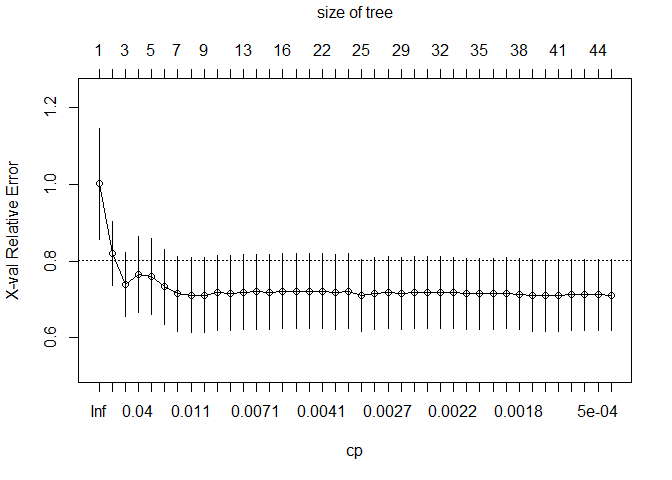<!-- -->

    ## 
    ## Optimal Complexity Parameter (CP): 0.001113502

    ## Final Tree Size: 79 nodes

    ## 
    ## === Test Set Evaluation ===

    ## MSE: 39.0057

    ## RMSE: 6.2455

    ## R-squared: 0.2967

    ## 
    ## === Variable Importance ===

    ##        NO       NO2   GTrouen       SO2 GTlehavre     T.max     T.moy    PL.som 
    ## 18440.100  9201.996  6530.975  4794.136  4708.561  4554.848  4142.218  3398.593 
    ##    VV.moy    HR.min    HR.moy    PA.moy     T.min  DV.maxvv    DV.dom    VV.max 
    ##  3125.636  3004.276  2886.841  2252.807  2200.831  1567.724  1298.321  1221.588 
    ##    HR.max 
    ##   190.127

    ## 
    ## === Decision Tree Structure ===

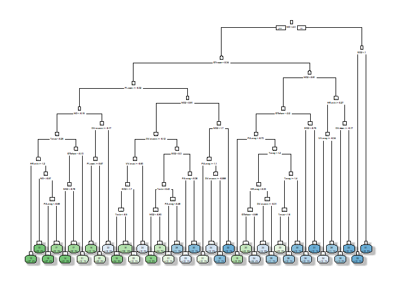<!-- -->

## 4.2 Fine-tuned RPART

    ## 
    ## === Cross-Validation Results ===

    ## Mean Cross-Validation MSE: 54.0182

    ## Mean Cross-Validation RMSE: 7.2328

    ## Mean Cross-Validation R-squared: 0.2399

    ## 
    ## === RPART Model Summary ===

    ## 
    ## Regression tree:
    ## rpart(formula = Y ~ ., data = train_df, method = "anova", control = rpart.control(xval = 5, 
    ##     cp = 1e-04, minsplit = 5, minbucket = 10, maxdepth = 8))
    ## 
    ## Variables actually used in tree construction:
    ##  [1] DV.dom    DV.maxvv  GTlehavre GTrouen   HR.max    HR.min    HR.moy   
    ##  [8] NO        NO2       PA.moy    PL.som    SO2       T.max     T.min    
    ## [15] T.moy     VV.max    VV.moy   
    ## 
    ## Root node error: 61335/825 = 74.346
    ## 
    ## n= 825 
    ## 
    ##            CP nsplit rel error  xerror     xstd
    ## 1  0.25517987      0   1.00000 1.00223 0.144371
    ## 2  0.10154940      1   0.74482 0.82093 0.083245
    ## 3  0.04671272      2   0.64327 0.73958 0.083976
    ## 4  0.03412636      3   0.59656 0.76509 0.098611
    ## 5  0.03279346      4   0.56243 0.76077 0.098600
    ## 6  0.01844332      5   0.52964 0.73297 0.097577
    ## 7  0.01236063      6   0.51119 0.71509 0.097459
    ## 8  0.01061341      7   0.49883 0.71177 0.097428
    ## 9  0.01019291      8   0.48822 0.71168 0.097624
    ## 10 0.01001096      9   0.47803 0.71814 0.097851
    ## 11 0.00953867     10   0.46802 0.71685 0.097854
    ## 12 0.00737893     12   0.44894 0.71968 0.097695
    ## 13 0.00686223     13   0.44156 0.71992 0.097800
    ## 14 0.00656108     14   0.43470 0.71862 0.097659
    ## 15 0.00453895     15   0.42814 0.72163 0.097769
    ## 16 0.00416810     16   0.42360 0.72182 0.097697
    ## 17 0.00416002     17   0.41943 0.72110 0.097690
    ## 18 0.00397222     21   0.40270 0.72110 0.097690
    ## 19 0.00392595     22   0.39873 0.71965 0.097566
    ## 20 0.00363165     23   0.39481 0.72156 0.097943
    ## 21 0.00355867     24   0.39117 0.71079 0.093855
    ## 22 0.00292707     25   0.38762 0.71455 0.093875
    ## 23 0.00246573     27   0.38176 0.71714 0.093847
    ## 24 0.00239588     28   0.37930 0.71625 0.093830
    ## 25 0.00236303     29   0.37690 0.71849 0.093738
    ## 26 0.00233135     30   0.37454 0.71849 0.093738
    ## 27 0.00216728     31   0.37220 0.71760 0.093739
    ## 28 0.00214497     32   0.37004 0.71718 0.093652
    ## 29 0.00210625     33   0.36789 0.71461 0.093148
    ## 30 0.00209268     34   0.36579 0.71461 0.093148
    ## 31 0.00207391     35   0.36369 0.71461 0.093148
    ## 32 0.00187195     36   0.36162 0.71702 0.093181
    ## 33 0.00167796     37   0.35975 0.71423 0.093126
    ## 34 0.00135113     38   0.35807 0.71018 0.093115
    ## 35 0.00111350     39   0.35672 0.70978 0.093054
    ## 36 0.00064252     40   0.35561 0.71031 0.093051
    ## 37 0.00059767     41   0.35496 0.71217 0.093064
    ## 38 0.00057838     42   0.35437 0.71217 0.093064
    ## 39 0.00043124     43   0.35379 0.71257 0.093062
    ## 40 0.00010000     44   0.35336 0.71180 0.093061

<!-- -->

    ## 
    ## One Standard Error Optimal Complexity Parameter (CP): 0.04671272

    ## Final Tree Size: 5 nodes

    ## 
    ## === Test Set Evaluation ===

    ## MSE: 45.6268

    ## RMSE: 6.7548

    ## R-squared: 0.1773

    ## 
    ## === Variable Importance ===

    ##         NO    GTrouen        NO2  GTlehavre      T.max     HR.min        SO2 
    ## 15651.5715  6228.5780  3912.8929  2890.9012  1760.8216  1208.9223  1117.9694 
    ##     VV.moy      T.moy     HR.moy 
    ##  1117.9694  1103.7986   893.5513

    ## 
    ## === Decision Tree Structure ===

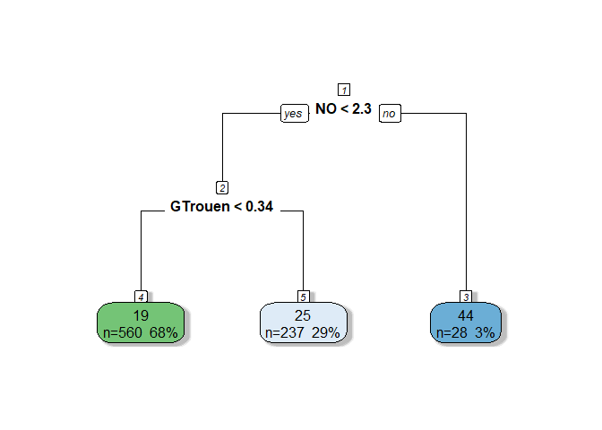<!-- -->

## 4.3 Basic Random forest

    ## 
    ## === Cross-Validation Results (Regression) ===

    ## Mean CV MSE: 32.168

    ## Mean CV RMSE: 5.5379

    ## Mean CV R-squared: 0.5766

    ## 
    ## === Test Set Evaluation (Regression) ===

    ## Test MSE: 26.388

    ## Test RMSE: 5.1369

    ## Test R-squared: 0.5242

    ## 
    ## === Variable Importance ===

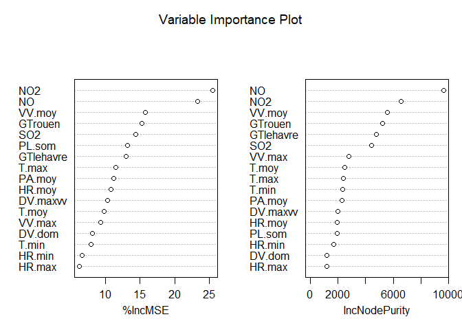<!-- -->

## 4.4 Random forest with VSURF

    ## 
    ## === Cross-Validation Results (Regression) ===

    ## Mean MSE: 32.168

    ## Mean RMSE: 5.5379

    ## Mean R-squared: 0.5766

    ## Thresholding step
    ## Estimated computational time (on one core): 27.8 sec.
    ## 
    ## Interpretation step (on 17 variables)
    ## Estimated computational time (on one core): between 5.1 sec. and  37.4 sec.
    ## 
    ## Prediction step (on 11 variables)
    ## Maximum estimated computational time (on one core): 17.6 sec.
    ##   |                                                                              |                                                                      |   0%  |                                                                              |======                                                                |   9%  |                                                                              |=============                                                         |  18%  |                                                                              |===================                                                   |  27%  |                                                                              |=========================                                             |  36%  |                                                                              |================================                                      |  45%  |                                                                              |======================================                                |  55%  |                                                                              |=============================================                         |  64%  |                                                                              |===================================================                   |  73%  |                                                                              |=========================================================             |  82%  |                                                                              |================================================================      |  91%  |                                                                              |======================================================================| 100%

    ## 
    ## === Test Set Evaluation (Regression) ===

    ## Test MSE: 29.2708

    ## Test RMSE: 5.4103

    ## Test R-squared: 0.4722

    ## 
    ## === Variable Importance ===

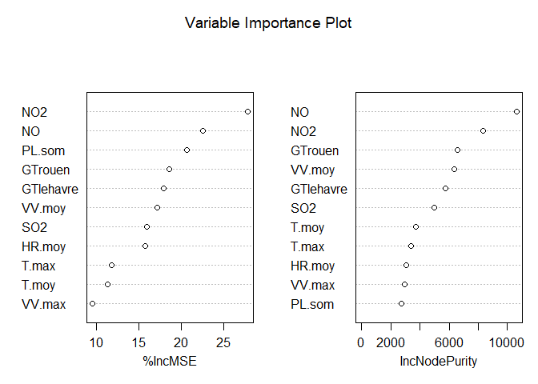<!-- --> \## 4.5
Conclusion

| Model                    |  CV_MSE | CV_RMSE |  CV_R2 | Test_MSE | Test_RMSE | Test_R2 |
|:-------------------------|--------:|--------:|-------:|---------:|----------:|--------:|
| Basic rpart              | 54.0182 |  7.2328 | 0.2399 |  39.0057 |    6.2455 |  0.2967 |
| Fine-tuned rpart         | 54.0182 |  7.2328 | 0.2399 |  45.6268 |    6.7548 |  0.1773 |
| Basic random forest      | 32.1680 |  5.5379 | 0.5766 |  26.3880 |    5.1369 |  0.5242 |
| Random forest with VSURF | 32.1680 |  5.5379 | 0.5766 |  27.4477 |    5.2391 |  0.5051 |

The performance comparison shows that the random forest models
outperform the decision tree models. Both versions of the random forest
(basic and VSURF-enhanced) have lower cross-validation and test MSE as
well as higher R-squared values compared to the rpart models. Notably,
the basic random forest achieves the best performance on the test set
with a Test MSE of 26.388 and a Test R² of 0.5242, indicating that
ensemble methods capture the underlying patterns more effectively.

On the other hand, while the fine-tuned rpart model (with only 5 nodes)
offers a simpler and more interpretable tree structure, its test
performance (Test R² of 0.1773) is considerably poorer than that of the
more complex basic rpart model (Test R² of 0.2967). This suggests that
in this case, the additional complexity in the basic rpart tree is
beneficial for prediction.

# 5. Overall Conclusion

    ##                 Model  CV MSE CV RMSE CV R² Test MSE Test RMSE Test R²
    ## 1  Stepwise Selection 34.2779  5.7463 0.5378  27.8327    5.2757   0.4981
    ## 2               Lasso 34.5082  5.8744 0.5364  27.9424    5.2861   0.4961
    ## 3 Basic random forest 32.1680  5.5379 0.5766  26.3880    5.1369   0.5242

While the enhancements achieved by Stepwise Selection and Lasso over the
basic OLS model are minimal, the Basic random forest offers the best
performance among the compared models. However, even this improvement is
moderate, indicating that while the random forest does yield better
predictive accuracy, the gains are not extraordinarily large. It’s worth
noting that the concept of the reduction of the number of features is
not very efficient for this dataset. Even within the random forest
models, employing a variable selection method such as VSURF resulted in
worse performance compared to the Basic random forest. This reinforces
the idea that with a relatively small set of predictors, using all
available features can be more effective than reducing the feature set.

# Task 3: Cross-Validation Function for OLS vs CART

**Task statement.** Implement a function that computes cross-validation
error to compare a linear model fitted with ordinary least squares and a
CART model.

Below is a sample function to perform cross-validation error to compare
the linear model computed thanks to ordinary least-square and CART
algorithm

``` r
cv_compare <- function(formula, data, k = 10, seed = NULL, 
                      loss = function(y, pred) mean((y - pred)^2)) {
    # Check if rpart package is installed
    if (!requireNamespace("rpart", quietly = TRUE)) {
        stop("Package 'rpart' is required for CART. Please install it.")
    }
    
    # Set seed for reproducibility if provided
    if (!is.null(seed)) {
        set.seed(seed)
    }
    
    # Number of observations
    n <- nrow(data)
    if (k > n) {
        stop("Number of folds 'k' cannot exceed the number of observations.")
    }
    
    # Create folds
    folds <- sample(rep(1:k, length.out = n))
    
    # Initialize vectors to store errors
    ols_errors <- numeric(k)
    cart_errors <- numeric(k)
    
    # Perform k-fold cross-validation
    for (i in 1:k) {
        # Split data into training and test sets
        test_indices <- which(folds == i)
        train_data <- data[-test_indices, ]
        test_data <- data[test_indices, ]
        
        # Fit OLS model and compute error
        lm_model <- lm(formula, data = train_data)
        pred_lm <- predict(lm_model, newdata = test_data)
        y_test <- model.response(model.frame(formula, test_data))
        ols_errors[i] <- loss(y_test, pred_lm)
        
        # Fit CART model and compute error
        cart_model <- rpart::rpart(formula, data = train_data, method = "anova")
        pred_cart <- predict(cart_model, newdata = test_data)
        cart_errors[i] <- loss(y_test, pred_cart)
    }
    
    # Return results
    list(
        ols_cv_error = mean(ols_errors),
        cart_cv_error = mean(cart_errors),
        ols_errors_per_fold = ols_errors,
        cart_errors_per_fold = cart_errors
    )
}
```

## Contact
Nikolai Len
👤 [LinkedIn](https://www.linkedin.com/in/niklen/)

